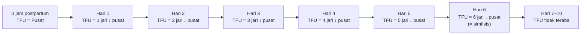
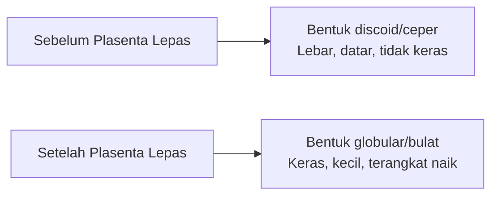
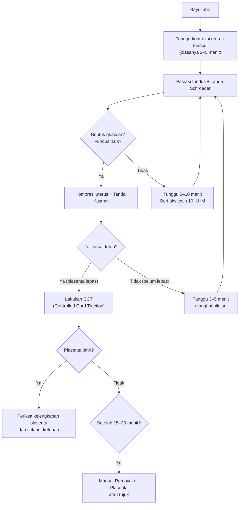

# Pemeriksaan Tinggi Fundus Postpartum

> [!info] Level Kompetensi SKDI: **4A** — Dokter umum mampu melakukan pemantauan tinggi fundus uteri (TFU) postpartum secara mandiri, menilai tanda-tanda pelepasan plasenta, dan mendeteksi dini retensio plasenta serta perdarahan postpartum.

---

## Kenapa Keterampilan Ini Penting

**Perdarahan postpartum (PPP)** tetap menjadi penyebab utama kematian ibu di Indonesia (30% dari seluruh kematian ibu), dengan risiko tertinggi pada **2 jam pertama** setelah persalinan (kala IV). Tiga mekanisme utama perdarahan postpartum — _tone_ (atonia uteri — 70%), _trauma_ (robekan jalan lahir — 20%), dan _tissue_ (retensio plasenta/sisa plasenta — 10%) — semuanya dapat dideteksi lebih awal melalui **pemeriksaan tinggi fundus postpartum yang sistematis**.

Keterampilan ini menjadi jembatan kritis antara Menolong Persalinan Fisiologis Apn (kala III) dan Memperkirakan Kehilangan Darah (estimasi perdarahan). Tanpa kemampuan menilai tinggi fundus dan mendeteksi tanda-tanda pelepasan plasenta secara tepat, risiko _missed diagnosis_ retensio plasenta, perdarahan postpartum yang tertunda, dan subinvolusi uterus meningkat secara signifikan.

> [!tip] **Pesan Kunci:** TFU postpartum turun secara teratur — sepusar saat 0 jam, turun 1 jari (~1 cm) setiap 24 jam. Setiap penyimpangan dari pola ini harus dievaluasi sebagai kemungkinan retensio sisa plasenta, atonia uteri, atau infeksi.

---

## Vignette Klinis

> **Vignette 1 — Kala IV Normal di RSKH:**
> Ny. A, 28 tahun, G1P1A0, baru saja melahirkan bayi perempuan spontan pervaginam di **RSKH (Rumah Sakit Khusus Ibu dan Anak) Bahagia**, Jakarta. Plasenta lahir lengkap 8 menit pasca persalinan dengan berat 520 g. Kontraksi uterus baik, perdarahan ±150 cc. Perineum utuh. Pukul 10.15 WIB (30 menit postpartum), TFU teraba **setinggi pusat (sepusar)**, uterus keras dan bulat. Kandung kemih kosong. Tanda vital: TD 110/70, N 84, P 20, S 36,6°C.
>
> **Vignette 2 — Kecurigaan Retensio Plasenta:**
> Ny. B, 32 tahun, G3P2A0, melahirkan di **RSKH Ibu dan Anak Pertiwi** dengan BB lahir 3.600 g. Setelah 15 menit, plasenta belum lahir. Tanda Kustner negatif, Schroeder negatif, perdarahan aktif ±300 cc. Dilakukan _manual removal of placenta_ di kamar bersalin; plasenta ditemukan melekat parsial. Pasca evakuasi, kontraksi uterus membaik, TFU turun 2 jari di bawah pusat.

> **Vignette 3 — Subinvolusi Postpartum:**
> Ny. C, 24 tahun, primipara, 6 hari postpartum kontrol di poliklinik **RSKH Melati**. TFU masih 2 jari di bawah pusat (seharusnya 6 jari di bawah pusat — involusi lambat). Lochea rubra masih ada, berbau agak anyir. Dicurigai sisa plasenta + endometritis. Dilakukan USG: ditemukan _retained product of conception_ (RPOC) 3×2 cm. Dilakukan Kuretase atas indikasi sisa plasenta.

---

## Anatomi & Fisiologi Involusi Uterus

### Involusi Uterus Normal

**Involusi uterus** adalah proses kembalinya uterus ke ukuran dan kondisi pra-hamil setelah persalinan. Proses ini melibatkan:

| Parameter                 | Segera Postpartum | 1 Minggu | 2 Minggu | 6 Minggu                         |
| ------------------------- | ----------------- | -------- | -------- | -------------------------------- |
| Berat uterus              | ~1.000 g          | ~500 g   | ~350 g   | ~50–100 g                        |
| TFU (jari di bawah pusat) | Sepusar (0 jam)   | 3–4 jari | 5–6 jari | Tidak teraba (di bawah simfisis) |
| Volume uterus             | ~5.000 cc         | —        | —        | Normal (5–10 cc)                 |
| Lebar uterus              | 12–14 cm          | —        | —        | 6–8 cm                           |

### Penurunan TFU Postpartum — Aturan Praktis

> [!info] **Aturan "1 Jari Per Hari":**
>
> - **0 jam** → TFU **setinggi pusat (sepusar)**
> - **Hari 1** → TFU **1 jari di bawah pusat** (~1 cm)
> - **Hari 2** → TFU **2 jari di bawah pusat** (~2 cm)
> - **Hari 3** → TFU **3 jari di bawah pusat** (~3 cm)
> - **Hari 4** → TFU **4 jari di bawah pusat** (~4 cm)
> - **Hari 5** → TFU **5 jari di bawah pusat** (~5 cm)
> - **Hari 6** → TFU **6 jari di bawah pusat** (~6 cm) — _setinggi simfisis_
> - **Hari 7–10** → TFU **tidak teraba lagi** di atas simfisis (masuk ke panggul kecil)

**Konversi ke sentimeter:** 1 jari pasien ≈ 1–1,5 cm. Lebih akurat bila diukur dengan pita sentimeter dari simfisis pubis ke fundus.



### Faktor yang Memengaruhi Kecepatan Involusi

| Mempercepat Involusi           | Memperlambat Involusi (→ Waspada!)    |
| ------------------------------ | ------------------------------------- |
| Menyusui (oksitosin endogen ↑) | Retensio sisa plasenta                |
| Mobilisasi dini                | Infeksi / endometritis                |
| Kandung kemih kosong           | Kandung kemih penuh                   |
| Uterus berkontraksi baik       | Atonia uteri                          |
| Primipara (tonus lebih baik)   | Grandemultipara (otot uterus longgar) |
|                                | Fibroid uterus (mioma uteri)          |
|                                | Kelainan involusi (subinvolusi)       |

### Perubahan Lokhea

| Jenis             | Warna            | Waktu               | Makna Klinis                          |
| ----------------- | ---------------- | ------------------- | ------------------------------------- |
| **Rubra**         | Merah segar      | 1–3 hari postpartum | Normal: darah segar + sisa desidua    |
| **Sanguinolenta** | Merah kecoklatan | 3–7 hari            | Normal: darah campur serous           |
| **Serosa**        | Kuning kemerahan | 7–14 hari           | Normal: serum, leukosit, desidua      |
| **Alba**          | Putih kekuningan | >14 hari            | Normal: leukosit, bakteri, sel epitel |

### Tanda Bahaya Lokhea

| Temuan                                                | Kecurigaan                          | Tindakan               |
| ----------------------------------------------------- | ----------------------------------- | ---------------------- |
| Bau busuk / amis                                      | Endometritis / infeksi              | Kultur + antibiotik    |
| Merah segar >3 hari atau merah kembali setelah serosa | Sisa plasenta / perdarahan sekunder | USG + evaluasi         |
| Tidak ada lokhea sama sekali (lokhea stasis)          | _Lochiometra_                       | USG + dilatasi serviks |
| Jumlah sangat banyak (>1 pembalut penuh/jam)          | Perdarahan postpartum sekunder      | Segera evaluasi        |

---

## Tanda-Tanda Pelepasan Plasenta (Kala III)

> [!warning] **Sebelum melakukan traksi tali pusat, PASTIKAN plasenta sudah lepas.** Traksi pada plasenta yang belum lepas dapat menyebabkan inversio uteri, robekan tali pusat, dan perdarahan hebat.

Tiga tanda klasik pelepasan plasenta dari dinding uterus — dinamai dari para ahli obstetri abad ke-19/20 — harus diperiksa secara berurutan sebelum memutuskan untuk melakukan _controlled cord traction_ (CCT) atau _manual removal of placenta_.

### 1. Tanda Kustner

| Aspek                              | Deskripsi                                                                                                                                                                                                    |
| ---------------------------------- | ------------------------------------------------------------------------------------------------------------------------------------------------------------------------------------------------------------ |
| **Tokoh**                          | Otto Kustner (Jerman, 1880-an)                                                                                                                                                                               |
| **Teknik**                         | Letakkan tangan di atas simpisis pubis (kiri), tekan uterus ke arah kranial-ventral (ke atas dan depan). Sementara itu, tarik tali pusat secara perlahan ke arah bawah.                                      |
| **Positif (Plasenta Lepas)**       | Tali pusat **tidak tertarik kembali** ke dalam vagina saat uterus ditekan — plasenta sudah lepas dan turun ke segmen bawah uterus / vagina.                                                                  |
| **Negatif (Plasenta Belum Lepas)** | Tali pusat **tertarik kembali** ke dalam vagina saat uterus ditekan — plasenta masih melekat pada dinding uterus.                                                                                            |
| **Mekanisme**                      | Tekanan pada uterus mendorong korpus uteri ke atas, sementara plasenta yang sudah lepas tetap di tempatnya. Bila plasenta masih melekat, fundus akan menarik plasenta dan tali pusat ikut tertarik ke dalam. |

> [!tip] **Cara mudah mengingat:** Kustner → **K**ompresi uterus → tali pusat **tidak** masuk lagi → plasenta **lepas**.

### 2. Tanda Schroeder

| Aspek                              | Deskripsi                                                                                                                                                                                                               |
| ---------------------------------- | ----------------------------------------------------------------------------------------------------------------------------------------------------------------------------------------------------------------------- |
| **Tokoh**                          | Karl Schroeder (Jerman, 1870-an)                                                                                                                                                                                        |
| **Teknik**                         | Palpasi fundus uteri melalui dinding abdomen.                                                                                                                                                                           |
| **Positif (Plasenta Lepas)**       | Uterus berubah bentuk menjadi **bulat, keras, dan lebih kecil**, serta **teraba naik ke atas** (ke arah umbilikus). Bentuk uterus menjadi _globular_. Posisi fundus naik hingga setinggi pusat atau sedikit di atasnya. |
| **Negatif (Plasenta Belum Lepas)** | Uterus tetap berbentuk **ceper (discoid)** dan teraba lebar — seperti piring datar. Fundus tidak naik.                                                                                                                  |
| **Mekanisme**                      | Setelah plasenta lepas, uterus berkontraksi dan massa plasenta turun ke segmen bawah uterus, sehingga korpus uteri mengecil, mengeras, dan terangkat ke atas — seperti bola yang terlepas dari beban.                   |

> [!tip] **Cara mudah mengingat:** Schroeder → bentuk uterus berubah → **S**chroeder → **S**tasioner → **S**epas (lepas).

#### Ilustrasi Palpasi Bentuk Uterus



### 3. Tanda Strassman

| Aspek                              | Deskripsi                                                                                                                                                                                           |
| ---------------------------------- | --------------------------------------------------------------------------------------------------------------------------------------------------------------------------------------------------- |
| **Tokoh**                          | Paul Strassman (Jerman, awal 1900-an)                                                                                                                                                               |
| **Teknik**                         | Ketuk (atau tepuk) fundus uteri dengan ringan menggunakan tangan kanan. Sementara itu, tangan kiri memegang tali pusat dengan jepitan ringan (klem di tali pusat).                                  |
| **Positif (Plasenta Lepas)**       | **Tidak ada gelombang/denyut** yang terasa pada tali pusat saat fundus diketik — karena aliran darah dari plasenta ke tali pusat sudah terputus.                                                    |
| **Negatif (Plasenta Belum Lepas)** | **Teraba denyutan/gelombang** pada tali pusat yang terintegrasi dengan detakan fundus — karena sirkulasi uteroplasenta masih aktif dan tekanan pada fundus menyalur melalui plasenta ke tali pusat. |
| **Keterbatasan**                   | Tanda ini paling jarang digunakan di klinik karena lebih sulit diinterpretasi dan membutuhkan latihan. Lebih sering digunakan sebagai konfirmasi.                                                   |

> [!tip] **Cara mudah mengingat:** Strassman → **S**tress (tekan/ketuk) fundus → **S**enyap tali pusat → **S**epas.

### Tabel Perbandingan Tanda Plasenta Lepas

| Tanda         | Yang Dinilai                            | Positif (Lepas)                        | Negatif (Belum Lepas)    | Keandalan           |
| ------------- | --------------------------------------- | -------------------------------------- | ------------------------ | ------------------- |
| **Kustner**   | Tarikan tali pusat saat kompresi uterus | Tali pusat tetap / tidak masuk kembali | Tali pusat masuk kembali | ★★★★ (paling andal) |
| **Schroeder** | Bentuk dan posisi uterus                | Globular, keras, naik                  | Ceper, lebar, rendah     | ★★★★                |
| **Strassman** | Denyut tali pusat saat fundus diketik   | Tidak ada denyutan                     | Ada denyutan             | ★★★ (konfirmasi)    |

### Alur Penilaian Pelepasan Plasenta



---

## Pemeriksaan Tinggi Fundus Postpartum (Kala IV)

### Definisi Kala IV

**Kala IV** adalah periode observasi 2 jam pertama setelah lahirnya plasenta. Ini adalah periode paling kritis karena risiko perdarahan postpartum tertinggi terjadi dalam 2 jam pertama. WHO dan Kemenkes RI merekomendasikan pemantauan ketat setiap 15 menit pada jam pertama dan setiap 30 menit pada jam kedua.

### Jadwal Pemantauan Kala IV

| Waktu           | Frekuensi Pemeriksaan | Parameter                                                       |
| --------------- | --------------------- | --------------------------------------------------------------- |
| 0–1 jam pertama | **Setiap 15 menit**   | TFU, kontraksi uterus, perdarahan, tanda vital (TD, Nadi, Suhu) |
| 1–2 jam         | **Setiap 30 menit**   | TFU, kontraksi uterus, perdarahan, tanda vital                  |
| 2–6 jam         | **Setiap 1 jam**      | TFU, kontraksi, perdarahan, lokhea, kandung kemih               |
| 6–24 jam        | **Setiap 4 jam**      | TFU, kontraksi, lokhea, tanda vital                             |

---

## Persiapan

### Alat dan Bahan

| Alat                               | Kegunaan                                                                            |
| ---------------------------------- | ----------------------------------------------------------------------------------- |
| **Pita ukur / metline**            | Mengukur TFU dalam cm (dari simfisis ke fundus) — lebih akurat dari jari            |
| **Senter / lampu sorot**           | Memeriksa perineum, laserasi, perdarahan                                            |
| **Sarung tangan DTT/steril**       | Pemeriksaan dalam bila perlu                                                        |
| **Kassa steril (banyak)**          | Membersihkan perineum, menilai perdarahan                                           |
| **Pembalut ibu bersalin / pad**    | Menampung lokhea dan perdarahan                                                     |
| **Tensimeter + stetoskop**         | Monitoring tanda vital                                                              |
| **Timbangan + ukuran**             | Menimbang pembalut untuk estimasi perdarahan (lihat Memperkirakan Kehilangan Darah) |
| **Underpad / perlak**              | Melindungi tempat tidur                                                             |
| **Oksitosin 10 IU (dalam spuit)**  | Sedia untuk atonia uteri                                                            |
| **Methergin 0,2 mg (IM)**          | Alternatif untuk atonia uteri (kontraindikasi hipertensi!)                          |
| **Infus set + RL / Ringer Laktat** | Untuk resusitasi cairan bila perdarahan >500 cc                                     |
| **Kateter urine**                  | Bila kandung kemih penuh dan pasien tidak bisa BAK                                  |
| **Klem ovum / Klem Rampley**       | Untuk eksplorasi sisa plasenta                                                      |
| **Kuretase set**                   | Untuk evakuasi sisa plasenta (oleh dokter spesialis)                                |

### Persiapan Pasien

1. **Informed consent** — jelaskan bahwa pemeriksaan TFU dan pantauan perdarahan akan dilakukan secara berkala selama 2 jam pertama dan setiap 4–6 jam berikutnya.

   > _"Ibu, kami akan memeriksa perut Ibu secara berkala untuk memastikan rahim ibu mengerut dengan baik dan tidak ada perdarahan berlebihan. Tolong beri tahu kalau ada rasa nyeri atau keluar darah banyak."_

2. **Kosongkan kandung kemih** — kandung kemih penuh mendorong uterus ke atas dan lateral, menyebabkan TFU terlihat lebih tinggi dari sebenarnya, serta menghambat kontraksi uterus (meningkatkan risiko atonia/perdarahan).

3. **Posisi Ibu** — berbaring telentang (_dorsal recumbent_) dengan lutut sedikit ditekuk, agar abdomen rileks untuk palpasi fundus.

4. **Lepaskan perhiasan, pastikan tangan bersih** — untuk palpasi yang nyaman.

### Persiapan Pemeriksa

1. **Cuci tangan** — minimal cuci tangan biasa dengan sabun antimikroba.
2. **Sarung tangan** — gunakan sarung tangan DTT (desinfeksi tingkat tinggi) atau steril jika ada pemeriksaan dalam.
3. **Posisi pemeriksa** — berdiri di sisi kanan pasien.
4. **Pencahayaan** — cukup untuk melihat pembalut dan perineum.

---

## Langkah-Langkah

### A. Pemeriksaan Tinggi Fundus Uteri (TFU) Postpartum

#### Langkah 1 — Inspeksi dan Palpasi Dasar

1. **Perkenalan dan informed consent ulang** — jelaskan bahwa Anda akan memeriksa perutnya.
2. **Inspeksi abdomen:** amati kontur perut, adakah distensi, apakah uterus terlihat sebagai benjolan di perut bawah.
3. **Palpasi fundus:**
   - Letakkan tangan kiri di atas simpisis pubis (sebagai titik referensi).
   - Letakkan tangan kanan di perut bawah, gerakkan ke atas secara bertahap hingga teraba batas atas uterus (fundus).
   - **Ukur TFU** dalam dua cara:
     - **Metode jari:** dari pusat ke fundus — berapa jari di bawah/sejajar/di atas pusat.
     - **Metline:** dari simfisis pubis ke fundus dalam cm.
   - Nilai **konsistensi uterus**: keras (kontraksi baik) atau lembek (atonia).
   - Nilai **mobilitas uterus**: mudah digerakkan atau sulit (mungkin ada perlengketan/infeksi).

> [!tip] **Palpasi Fundus yang Benar:**
>
> - Gunakan **tepi ulnar tangan** (bukan ujung jari) untuk meraba fundus.
> - Tekan perlahan dari arah umbilikus ke bawah hingga teraba _kubah_ fundus.
> - Jangan menekan terlalu keras — pasien postpartum masih nyeri dan bisa vagal.

#### Langkah 2 — Catat Posisi TFU

Gunakan kode berikut untuk dokumentasi konsisten:

| Kode                    | Arti                              | Contoh                          |
| ----------------------- | --------------------------------- | ------------------------------- |
| **Tfu-sps**             | TFU setinggi pusat                | Tfu-sps                         |
| **Tfu-↑Xd**             | TFU X jari di atas pusat          | Tfu-↑1d (1 jari di atas pusat)  |
| **Tfu-↓Xj**             | TFU X jari di bawah pusat         | Tfu-↓3j (3 jari di bawah pusat) |
| **Tfu-↓Xcm**            | TFU X cm di bawah pusat (metline) | Tfu-↓4cm                        |
| **U-K** (Uterus Keras)  | Kontraksi baik                    | U-K (+)                         |
| **U-L** (Uterus Lembek) | Atonia uteri — waspada!           | U-L (+) → beri oksitosin        |

**Contoh dokumentasi:**

```
Pukul 10.30 WIB (45 menit postpartum):
- TFU ↓1j (1 jari di bawah pusat)
- U-K (+), keras, globular
- Perdarahan ±150 cc (1 pembalut basah)
- TD 115/75, N 88, P 20
- Kandung kemih kosong
- Kesan: Kala IV normal, kontraksi baik
```

#### Langkah 3 — Palpasi Uterus Setelah Masase

Setelah mencatat TFU, lakukan **masase uterus** dengan gerakan sirkular lembut (bukan menekan keras) untuk mengeluarkan bekuan darah:

1. Letakkan tangan di fundus.
2. Masase sirkular 5–10 putaran.
3. Keluarkan bekuan darah yang terperangkap di segmen bawah uterus.
4. Palpasi ulang — uterus harus teraba keras setelah masase.

> [!warning] **Jangan masase berlebihan!** Masase yang terlalu keras dan lama melelahkan otot uterus dan justru bisa menyebabkan atonia uteri sekunder. Cukup 5–10 putaran ringan.

#### Langkah 4 — Periksa Perdarahan Per Vagina

1. **Periksa pembalut:** berapa banyak darah? Ukur dengan menimbang pembalut (1 g ≈ 1 cc darah).
2. **Periksa perineum:** adakah laserasi/hematoma yang baru terlihat? (sering terjadi setelah episiotomi diperbaiki).
3. **Periksa lokhea:** warna (rubra/sanguinolenta), bau (normal anyir, infeksi busuk).
4. **Minta pasien miksi:** kandung kemih penuh adalah penyebab paling sering perdarahan postpartum ringan.

> [!tip] **Estimasi Cepat Kehilangan Darah — Lihat Memperkirakan Kehilangan Darah:**
> | Jumlah | Tanda Klinis |
> |--------|-------------|
> | < 500 cc | Biasanya tanpa gejala |
> | 500–1000 cc | Takikardi (N >100), pusing |
> | 1000–1500 cc | Hipotensi ortostatik, pucat |
> | > 1500 cc | Syok hipovolemik |

### B. Penilaian Pelepasan Plasenta (Kala III)

#### Langkah 1 — Tunggu Tanda Fisiologis Pelepasan

Setelah bayi lahir, tunggu kontraksi uterus spontan (biasanya 2–5 menit). **JANGAN** segera menarik tali pusat. Lakukan AMTSL (Active Management of Third Stage of Labor):

- Oksitosin 10 IU IM dalam 1 menit pertama setelah bayi lahir (lihat Menolong Persalinan Fisiologis Apn).
- _Controlled cord traction_ hanya setelah ada tanda pelepasan.

#### Langkah 2 — Nilai Tanda Schroeder

Palpasi uterus melalui dinding abdomen:

- **Bentuk globular?** → positif → plasenta lepas.
- **Bentuk ceper/discoid?** → negatif → plasenta belum lepas.

#### Langkah 3 — Nilai Tanda Kustner

1. Letakkan tangan kiri di atas simpisis, tekan uterus ke arah kranial-ventral.
2. Tangan kanan memegang klem tali pusat dengan jepitan ringan.
3. **Amati pergerakan tali pusat:**
   - **Tali pusat tidak masuk kembali** → Kustner positif → **plasenta lepas**.
   - **Tali pusat masuk kembali** → Kustner negatif → **plasenta belum lepas**.

#### Langkah 4 — Nilai Tanda Strassman (Konfirmasi)

1. Tangan kiri memegang tali pusat di klem.
2. Tangan kanan mengetuk fundus uteri ringan.
3. Rasakan apakah ada denyutan yang merambat ke tali pusat.
   - **Tidak ada denyutan** → Strassman positif → **plasenta lepas**.
   - **Ada denyutan** → Strassman negatif → **plasenta belum lepas**.

#### Langkah 5 — Lakukan CCT (Bila Semua Tanda Positif)

Setelah semua tanda lepas terkonfirmasi (minimal Kustner + Schroeder positif):

1. **Tegangkan tali pusat** dengan tangan kanan.
2. **Tangan kiri** melakukan _counter-traction_ dengan mendorong uterus ke arah kranial-ventral (**jangan dorong fundus!** — dorong segmen bawah uterus di atas simpisis).
3. **Tarik tali pusat** ke arah bawah-belakang (mengikuti kurva jalan lahir) secara perlahan dan mantap — **jangan menyentak**.
4. Saat plasenta muncul di introitus, **tangkan dengan kedua tangan** dan putar perlahan untuk melahirkan selaput ketuban secara utuh (jangan sampai robek).
5. **Segera periksa plasenta:** _maternal surface_ — utuh/tidak? Selaput — lengkap? Tali pusat — 2 arteri + 1 vena? (lihat ilustrasi di bawah).

> [!warning] **Jika CCT gagal (traksi tidak melahirkan plasenta setelah 2–3 kali tarikan):**
>
> - JANGAN memaksa traksi → risiko inversio uteri.
> - Nilai ulang tanda pelepasan.
> - Jika tanda pelepasan negatif atau perdarahan aktif:
>   - **Bila perdarahan <500 cc dan plasenta belum lepas >15–30 menit** → lakukan _manual removal of placenta_.
>   - **Bila perdarahan >500 cc** → segera lakukan _manual removal of placenta_.

### C. Pemeriksaan Plasenta — Apakah Lengkap?

Setelah plasenta lahir, periksa **kelengkapan plasenta** secara sistematis:

#### Pemeriksaan Maternal Surface

| Temuan                                                 | Interpretasi                          | Tindakan                                      |
| ------------------------------------------------------ | ------------------------------------- | --------------------------------------------- |
| Permukaan ibu utuh, kotiledon lengkap, tidak ada defek | Plasenta lengkap                      | Tidak perlu tindakan                          |
| Ada defek / sobekan pada maternal surface              | Sisa kotiledon tertinggal             | Evakuasi sisa plasenta (manual atau kuretase) |
| Tepi plasenta menyerupai _tanah longsor_               | _Sudden separation_ — curigai solusio | Catat, evaluasi perdarahan                    |

#### Pemeriksaan Fetal Surface (Selaput Ketuban)

| Temuan                                                                           | Interpretasi                                | Tindakan                            |
| -------------------------------------------------------------------------------- | ------------------------------------------- | ----------------------------------- |
| Selaput utuh, _ammion_ dan _chorion_ tercermin                                   | Lengkap                                     | Tidak perlu tindakan                |
| Ada robekan selaput — selaput tidak lengkap                                      | Sebagian selaput tertinggal                 | Observasi — biasanya keluar spontan |
| Sobekan melingkar mengelilingi plasenta (_circumvallate_ atau _circummarginate_) | Variasi normal                              | Catat                               |
| Tidak ada selaput sama sekali                                                    | Seluruh ketuban tertinggal → risiko infeksi | Evakuasi manual / kuretase          |

> [!tip] **Tes Apung (Floating Test):** Masukkan plasenta ke dalam baskom berisi air bersih. Plasenta utuh akan mengapung atau tenggelam sebagian karena ada udara di pembuluh darah tali pusat. Plasenta yang terfragmentasi akan tenggelam secara tidak beraturan. **Catatan:** tes ini hanya sebagai panduan kasar dan tidak menggantikan pemeriksaan visual yang teliti.

#### Pemeriksaan Tali Pusat

| Temuan                                                       | Interpretasi                                                   |
| ------------------------------------------------------------ | -------------------------------------------------------------- |
| 2 arteri (lumen kecil, dinding tebal) + 1 vena (lumen besar) | Normal — 3 pembuluh darah                                      |
| Hanya 1 arteri (2 pembuluh darah total)                      | _Single umbilical artery_ — kaitkan dengan kelainan kongenital |
| Panjang >100 cm                                              | Panjang abnormal — risiko _nuchal cord_                        |
| Panjang <30 cm                                               | _Short cord_ — risiko solusio/inversio                         |
| Tali pusat sangat tipis                                      | Curigai _jejune cord_                                          |

### D. Pemeriksaan Kala IV Lanjutan

#### Setiap 15 Menit (Jam Pertama)

| Langkah | Pemeriksaan        | Temuan Normal                                 | Temuan Abnormal                                        |
| ------- | ------------------ | --------------------------------------------- | ------------------------------------------------------ |
| 1       | Palpasi TFU        | ↓1j dari pusat                                | Tetap sepusar atau naik (kandung kemih penuh / atonia) |
| 2       | Konsistensi uterus | Keras, globular                               | Lembek (atonia uteri)                                  |
| 3       | Perdarahan vaginal | < pembalut penuh/15 menit                     | > 1 pembalut basah dalam 15 menit                      |
| 4       | Tanda vital        | TD ≥ 90/60, N < 100                           | TD < 90/60, N > 100                                    |
| 5       | Tanyakan keluhan   | Pusing (-), pandangan (-), lemas ringan wajar | Pusing berat, pandangan gelap, ingin pingsan           |

#### Setiap 30 Menit (Jam Kedua)

Sama seperti di atas, namun interval diperpanjang. Pada akhir jam ke-2, lakukan pemeriksaan menyeluruh:

1. Catat TFU akhir — harus sudah 1–2 jari di bawah pusat.
2. Catat total estimasi perdarahan (lihat Memperkirakan Kehilangan Darah).
3. Nilai kandung kemih — pastikan kosong.
4. Pastikan uterus kontraksi baik.
5. Catat tanda vital akhir.

---

## Interpretasi Hasil

### TFU Normal vs Abnormal

| Temuan                                                                             | Interpretasi                                                                         | Tindakan                                                                            |
| ---------------------------------------------------------------------------------- | ------------------------------------------------------------------------------------ | ----------------------------------------------------------------------------------- |
| TFU sepusar — uterus keras                                                         | Kala IV normal (0 jam)                                                               | Observasi rutin                                                                     |
| TFU 1–2 jari di bawah pusat — uterus keras                                         | Kala IV normal (1–2 jam)                                                             | Observasi rutin                                                                     |
| TFU masih sepusar setelah 2 jam                                                    | Involusi lambat — curigai retensio sisa plasenta / kandung kemih penuh / subinvolusi | Kosongkan kandung kemih → ulang palpasi. Jika masih sepusar → USG (+ sisa plasenta) |
| TFU naik (di atas pusat)                                                           | Kandung kemih penuh / atonia uteri / perdarahan intrauterine tersembunyi             | Segera kosongkan kandung kemih. Jika perdarahan → provokasi masase + oksitosin      |
| TFU turun lebih cepat dari normal (< 1 jari per hari adalah _lambat_, bukan cepat) | —                                                                                    | Tidak ada masalah — involusi normal (tidak perlu dikhawatirkan turun cepat)         |
| TFU tidak turun dalam 3 hari                                                       | Retensio sisa plasenta / infeksi                                                     | USG → kuretase jika RPOC (+)                                                        |
| TFU teraba lembek                                                                  | Atonia uteri → perdarahan                                                            | Masase + oksitosin / methergin                                                      |
| TFU nyeri tekan hebat                                                              | Infeksi / endometritis / abses                                                       | Antibiotik + USG                                                                    |

> [!warning] **Penyebab TFU Tetap Tinggi Pasca Persalinan:**
>
> 1. Kandung kemih penuh (paling sering) — koreksi dengan kateterisasi
> 2. Retensio sisa plasenta (RPOC)
> 3. Bekuan darah intrauterin
> 4. Atonia uteri
> 5. Infeksi / endometritis
> 6. Mioma uteri (mengganggu involusi)

### Tanda Bahaya Retensio Plasenta

| Temuan                                                | Makna                                   | Tindakan                                            |
| ----------------------------------------------------- | --------------------------------------- | --------------------------------------------------- |
| Plasenta belum lahir > 30 menit                       | _Retained placenta_ (retensio plasenta) | Manual removal of placenta                          |
| Tanda Kustner/Schroeder negatif                       | Plasenta belum lepas                    | Tunggu + oksitosin. Jika >15 menit → manual removal |
| Perdarahan aktif > 500 cc dengan plasenta belum lahir | Perdarahan postpartum karena retensio   | Segera manual removal (jangan tunggu 30 menit!)     |
| Plasenta lahir tidak lengkap                          | Sisa plasenta (RPOC)                    | Evakuasi manual / kuretase + antibiotik             |
| Demam > 38°C + TFU tinggi + lokhea bau                | Endometritis postpartum                 | Kultur + antibiotik spektrum luas                   |
| TFU tidak turun dalam 5–7 hari                        | Subinvolusi                             | USG → evaluasi RPOC                                 |
| Perdarahan postpartum sekunder (hari ke-5 s.d. 14)    | Sisa plasenta yang terinfeksi / infeksi | USG + kuretase + antibiotik                         |

---

## Kesalahan yang Sering Terjadi

| Kesalahan                                                        | Dampak                                                                                        | Cara Menghindari                                                                                  |
| ---------------------------------------------------------------- | --------------------------------------------------------------------------------------------- | ------------------------------------------------------------------------------------------------- |
| **Tidak memeriksa kandung kemih sebelum palpasi TFU**            | Underestimasi kontraksi uterus — kandung kemih penuh mendorong uterus ke lateral dan superior | Seluruh pemeriksaan TFU harus didahului dengan menanyakan/memeriksa kandung kemih                 |
| **Pemeriksaan TFU dengan metline tanpa landmark yang konsisten** | Variasi pengukuran yang tidak berarti                                                         | Gunakan selalu **simfisis pubis** sebagai titik nol — bukan pusat (pusat berubah-ubah)            |
| **Traksi tali pusat tanpa konfirmasi tanda lepas**               | Inversio uteri (emergensi berat — syok, perdarahan masif)                                     | **WAJIB** periksa minimal Kustner + Schroeder sebelum CCT                                         |
| **Masase uterus terlalu keras dan lama**                         | Atonia uteri sekunder; nyeri berlebihan                                                       | Masase cukup 5–10 putaran ringan — jika tidak berkontraksi, beri oksitosin                        |
| **Mengabaikan tanda Kustner negatif**                            | Traksi pada plasenta yang belum lepas → robekan tali pusat / inversio                         | Dokumentasikan tanda Kustner di setiap catatan kala III                                           |
| **Tidak memeriksa kelengkapan plasenta**                         | Retensio sisa plasenta yang tidak terdiagnosis → perdarahan sekunder                          | Seluruh plasenta harus diperiksa maternal + fetal surface dalam pencahayaan cukup                 |
| **Frekuensi pemantauan kala IV tidak sesuai standar**            | Keterlambatan deteksi perdarahan postpartum                                                   | Tempel jadwal pemantauan kala IV (15'/30'/1 jam) di dinding ruang nifas                           |
| **Tidak mencatat TFU di setiap pemeriksaan**                     | Tidak bisa memantau tren involusi                                                             | Dokumentasi SOAP setiap kali selesai pemeriksaan (wajib!)                                         |
| **Menganggap TFU yang tinggi hanya karena kandung kemih penuh**  | Missed diagnosis retensio sisa plasenta                                                       | Evaluasi penyebab lain: RPOC, infeksi, mioma — jangan hanya kateterisasi                          |
| **Tidak melakukan estimasi perdarahan secara objektif**          | Underestimasi kehilangan darah → syok terlambat                                               | Timbang pembalut (1 g = 1 cc) — jangan perkiraan visual saja                                      |
| **Tidak melibatkan pasien dalam edukasi tanda bahaya**           | Pasien pulang tanpa tahu kapan harus kembali                                                  | Edukasi: _"Bila perdarahan seperti haid berat atau demam atau nyeri perut hebat, segera kembali"_ |

### Tiga Kesalahan Fatal pada Kala III

> [!danger] **Kesalahan Fatal #1 — Traksi Tali Pusat Tanpa Tanda Lepas**
> Menarik tali pusat saat plasenta masih melekat dapat menyebabkan **inversio uteri** — di mana fundus uteri masuk ke dalam rongga vagina atau bahkan keluar dari introitus. Ini adalah kegawatdaruratan yang menyebabkan syok neurogenik + perdarahan masif.

> [!danger] **Kesalahan Fatal #2 — Dorongan Fundus (Crede)**
> Teknik _Crede's maneuver_ (mendorong fundus untuk melahirkan plasenta) sudah **ditinggalkan** karena risiko inversio uteri yang tinggi. Gunakan CCT dengan panduan Kustner, bukan Crede.

> [!danger] **Kesalahan Fatal #3 — Memotong Tali Pusat Terlalu Dekat Pangkal**
> Saat plasenta belum lahir dan tali pusat putus karena traksi berlebihan, jangan memotong sisa tali pusat — ini adalah _landmark_ untuk menemukan sisa plasenta di intrauterin. Biarkan sisa tali pusat menjulur dari serviks sebagai panduan.

---

## Edukasi Ibu Nifas

### Yang Harus Disampaikan Sebelum Pulang

| Topik                       | Edukasi                                                                                                            |
| --------------------------- | ------------------------------------------------------------------------------------------------------------------ |
| **Tanda bahaya perdarahan** | Segera ke RS bila perdarahan seperti haid berat/menggumpal, lebih dari 1 pembalut penuh per jam                    |
| **Kandung kemih**           | Jangan menahan BAK — kandung kemih penuh mengganggu kontraksi uterus dan meningkatkan perdarahan                   |
| **Menyusui**                | Menyusui memicu oksitosin alami → kontraksi uterus lebih baik → involusi lebih cepat                               |
| **Lokhea normal**           | Akan berubah dari merah → coklat → kuning → putih dalam 2–4 minggu                                                 |
| **Aktivitas**               | Istirahat cukup, hindari angkat berat, jalan santai diperbolehkan                                                  |
| **Pantau TFU di rumah**     | Jika rahim terasa seperti bola keras di perut bawah → normal. Jika terasa lembek dan perut membesar → segera ke RS |
| **Demam**                   | Bila demam >38°C dengan lokhea berbau dalam 3–10 hari → curiga endometritis                                        |
| **Kontrol**                 | Kontrol 7–14 hari postpartum untuk evaluasi involusi, lokhea, dan luka perineum                                    |

---

## Dipakai Untuk Kondisi Apa Saja

| Kondisi                            | Peran Pemeriksaan TFU / Plasenta                       |
| ---------------------------------- | ------------------------------------------------------ |
| **Kala IV normal**                 | Memantau involusi, mendeteksi atonia uteri dini        |
| **Atonia uteri**                   | TFU lembek, tinggi, perdarahan aktif → diagnosis cepat |
| **Retensio plasenta**              | Plasenta tidak lahir >30 menit                         |
| **Sisa plasenta (RPOC)**           | TFU tidak turun, perdarahan sekunder, USG (+)          |
| **Subinvolusi uteri**              | TFU turun lambat dari normal                           |
| **Endometritis postpartum**        | TFU tinggi + nyeri tekan + demam + lokhea bau          |
| **Perdarahan postpartum sekunder** | TFU tinggi + perdarahan baru setelah sempat berhenti   |
| **Inversio uteri**                 | Tidak teraba fundus di abdomen + perdarahan masif      |
| **Kandung kemih penuh**            | TFU naik tidak normal + uterus terdorong lateral       |

---

## Referensi

1. **Cunningham FG, et al.** _Williams Obstetrics_. 26th Ed. McGraw-Hill; 2022. — Bab 35: The Third Stage of Labor, Bab 36: The Fourth Stage of Labor, Bab 41: Postpartum Hemorrhage.
2. **Prawirohardjo S, Wiknjosastro H.** _Ilmu Kebidanan_. Edisi 4. Jakarta: PT Bina Pustaka Sarwono Prawirohardjo; 2014. — Bab 28: Kala III, Bab 29: Kala IV, Bab 30: Perdarahan Postpartum.
3. **Saifuddin AB.** _Buku Praktis Pelayanan Kesehatan Maternal dan Neonatal_. Jakarta: Yayasan Bina Pustaka Sarwono Prawirohardjo; 2018.
4. **Kementerian Kesehatan RI.** _Buku Saku Pelayanan Kesehatan Ibu di Fasilitas Kesehatan Tingkat Pertama_. Jakarta: Direktorat Gizi dan Kesehatan Ibu dan Anak; 2019.
5. **Peraturan Menteri Kesehatan RI No. HK.01.07/MENKES/1410/2021** tentang Standar Kompetensi Dokter Indonesia (SKDI). — Level 4A: Pemeriksaan Obstetri, Persalinan Normal.
6. **WHO.** _WHO Recommendations for the Prevention and Treatment of Postpartum Haemorrhage_. Geneva: World Health Organization; 2012.
7. **FIGO.** _Active Management of the Third Stage of Labour: Prevention and Treatment of Postpartum Hemorrhage_. FIGO Safe Motherhood and Newborn Health Committee; 2016.
8. **ACOG.** _Practice Bulletin No. 183: Postpartum Hemorrhage_. American College of Obstetricians and Gynecologists; 2017 (reaffirmed 2020).
9. **POGI.** _Pedoman Nasional Pelayanan Kedokteran: Perdarahan Postpartum_. Jakarta: Perkumpulan Obstetri dan Ginekologi Indonesia; 2020.
10. **Begley CM, et al.** _Active versus expectant management for women in the third stage of labour_. Cochrane Database of Systematic Reviews; 2019. — Bukti tingkat tinggi untuk AMTSL.

---

> [!note] **Revisi**
>
> - Versi 1.0 — 17 Juli 2026
> - Ditulis oleh Hermes Agent berdasarkan referensi standar obstetri.
> - Isi mencakup SKDI level 4A: kompetensi mandiri oleh dokter umum dalam pemantauan postpartum dan penilaian plasenta.
> - Terintegrasi dengan Menolong Persalinan Fisiologis Apn (tatalaksana kala III–IV) dan Memperkirakan Kehilangan Darah (estimasi perdarahan).
> - Untuk pembaruan, periksa protokol terbaru dari Kemenkes RI, WHO, POGI, dan ACOG.
