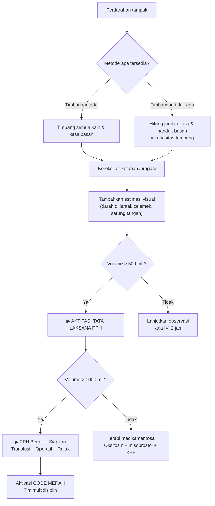

## Kenapa Keterampilan Ini Penting

**Perdarahan postpartum (PPH)** adalah penyebab utama kematian ibu di Indonesia (≈30% dari seluruh kematian ibu), dengan AKI yang masih jauh dari target SDGs. Ironisnya, sebagian besar kematian akibat PPH sebenarnya **dapat dicegah** — salah satu faktornya adalah **keterlambatan mengenali** bahwa perdarahan sudah melebihi batas aman.

Masalahnya: mata telanjang **sangat tidak akurat** dalam memperkirakan volume darah. Studi membuktikan bahwa tenaga kesehatan — termasuk dokter dan bidan berpengalaman — secara konsisten **meremehkan** perdarahan hingga 30–50% dari volume sebenarnya. Semakin banyak darah, semakin besar kesalahan estimasi visual. Akibatnya, resusitasi terlambat, syok hipovolemik tidak tertangani, dan ibu kehilangan kesempatan untuk diselamatkan.

Keterampilan memperkirakan kehilangan darah postpartum bukan sekadar "menebak" — ini adalah kombinasi antara **metode objektif** (timbangan, tampon, kasa), **kalkulasi** (darah di kain, lantai, ember), dan **korelasi klinis** (tanda vital, tanda syok, perfusi). Setiap penolong persalinan wajib menguasainya.

> [!tip] Prinsip Emas
> **Jangan percaya mata telanjang.** Jika Anda merasa perdarahan "banyak", kemungkinan besar sudah jauh melebihi batas. Gunakan metode objektif setiap kali menilai perdarahan — meskipun terlihat sedikit.

Keterampilan ini sangat terkait dengan [[31-postpartum-pemeriksaan-fundus]] (menilai kontraksi uterus sebagai penyebab tersering PPH) dan [[42-kompresi-bimanual]] (tindakan darurat saat PPH atonia uteri tidak terkendali).

---

## Vignette Klinis

> **Vignette I — Estimasi Visual yang Menyesatkan:**
> Ny. Rini, G2P1A0, 27 tahun, selesai melahirkan spontan pervaginam dengan BB lahir 3200 g. Plasenta lahir lengkap dalam 7 menit. Penolong memperkirakan perdarahan "sekitar 200 cc" — terlihat sedikit di kain alas. Namun setelah ditimbang, kain basah darah memiliki selisih berat 605 g dari kain kering. Setelah dikurangi berat cairan ketuban (estimasi 200 mL), perdarahan sebenarnya ≈ 400 mL. Kontraksi uterus lembek, fundus 3 jari di atas pusat. Tanda vital normal. Diberikan oksitosin tambahan dan KBE. Kasus ini memperlihatkan bahwa estimasi visual **meremehkan** volume hampir 2× lipat.

> **Vignette II — PPH Terselubung:**
> Ny. Wati, G3P2A0, 32 tahun, melahirkan dengan seksio sesarea (SC) atas indikasi letak sungsang. Operasi berlangsung 45 menit. Cairan di tabung suction: 900 mL. Kasa laporotomi basah: ada 5 kasa sedang (10×10 cm) + 2 kasa besar (25×25 cm) yang lembap darah, ditambah perdarahan di dinding abdomen yang dibersihkan dengan 3 kasa kecil. Estimasi total menggunakan metode weighted/timbang: 1175 mL. Ibu mulai pucat, nadi 110×/mnt, TD 90/60 mmHg. Syok hipovolemik derajat II. Segera dilakukan resusitasi cairan + transfusi. Estimasi awal visual oleh dokter jaga: "sekitar 700–800 cc" — underestimation hampir 50%.

> **Vignette III — Perdarahan Massif yang Terdeteksi Dini:**
> Ny. Aminah, G1P0A0, 24 tahun, postpartum 30 menit. Perdarahan tampak "merembes terus" — tidak menyembur tetapi kasa cepat penuh. Estimasi visual awal: 300 cc. Timbangan kain: 550 g. 15 menit kemudian kain basah lagi: 300 g tambahan. Total estimasi objektif: 850 mL — **PPH tersirat**. Fundus 2 jari di atas pusat, lembek. Nadi 108, TD 100/70. Segera dilakukan kompresi bimanual ([[42-kompresi-bimanual]]), oksitosin 10 IU IV drip, dan misoprostol 800 µg rektal. Perdarahan berhenti dalam 5 menit. Tanpa timbangan, kasus ini mungkin baru terdeteksi saat ibu sudah syok.

---

## Definisi dan Ambang Batas

### Perdarahan Postpartum (PPH)

| Jenis PPH | Definisi | Volume Pervaginam | Volume SC |
|-----------|----------|-------------------|-----------|
| **PPH primer** (early) | Dalam 24 jam pertama postpartum | **≥500 mL** | **≥1000 mL** |
| **PPH sekunder** (late) | 24 jam – 6 minggu postpartum | Berapapun + tanda infeksi | Berapapun + tanda infeksi |
| **PPH massif** | Perdarahan yang mengancam jiwa | >1500 mL atau >30% volume darah total | >2000 mL atau kebutuhan transfusi >4 unit |
| **PPH tersirat** | Tanda syok tanpa perdarahan tampak yang proporsional | Syok + fundus membesar/uterus atonia | Syok + perdarahan intraabdominal tersembunyi |

> [!warning] Ambang Bahaya
> - **>500 mL** pervaginam → sudah PPH — **aktifasi tata laksana**
> - **>1000 mL** → PPH berat — siapkan transfusi, operatif, rujuk
> - **>1500 mL** → PPH massif — aktivasi CODE MERAH (tim multidisiplin)
> - Kehilangan >40% volume darah total → syok ireversibel → kematian

### Volume Darah Total Ibu Hamil

| Parameter | Nilai |
|-----------|-------|
| Volume darah total ibu hamil aterm | ≈ 100 mL/kg BB (meningkat 40–50% dari tidak hamil) |
| Ibu 50 kg | ≈ 5000 mL |
| Ibu 60 kg | ≈ 6000 mL |
| Ibu 70 kg | ≈ 7000 mL |

Kehilangan **10–15%** volume darah total → kompensasi fisiologis (nadi naik ringan, TD masih normal — **masa tenang berbahaya**).
Kehilangan **15–25%** → takikardia, hipotensi ortostatik, vasokonstriksi.
Kehilangan **25–35%** → syok dekompensasi (TD turun, nadi >120, capillary refill >3 detik).
Kehilangan **>35–40%** → syok berat, anuria, penurunan kesadaran, multi-organ failure.

> [!tip] Fenomena "Masa Tenang" yang Mematikan
> Ibu hamil muda memiliki cadangan volume darah 40–50% lebih banyak. **Ibu bisa kehilangan 1000–1500 mL tanpa perubahan TD berarti** — sampai tiba-tiba kolaps. Inilah mengapa estimasi objektif jauh lebih penting daripada tanda vital dalam deteksi dini PPH.

---

## Metode Estimasi Kehilangan Darah

### 1. Metode Visual (Paling Sering — Paling Tidak Akurat)

Penolong memperkirakan volume darah dengan melihat:
- Kain alas partus
- Kasa dan tampon yang digunakan
- Genangan di lantai / meja operasi
- Cairan di tabung suction
- Blood loss di sarung tangan, celemek, seprei

**Akurasi:** Sangat rendah — **underestimate 30–50%** (dan makin parah bila volume makin besar).

**Studi kunci:** Razvi et al. (1996) — estimasi visual oleh bidan dan dokter hanya mendeteksi 50% dari volume aktual. Pada perdarahan >1000 mL, akurasi turun menjadi <30%.

| Perkiraan Visual | Volume Aktual Rata-rata (penelitian) | Kesalahan |
|------------------|---------------------------------------|-----------|
| 200 mL | 350–400 mL | 75–100% underestimate |
| 500 mL | 750–900 mL | 50–80% underestimate |
| 1000 mL | 1500–2000 mL | 50–100% underestimate |

> [!warning] **Jangan mengandalkan estimasi visual sebagai satu-satunya metode!** Gunakan sebagai skrining kasar saja — jika visual sudah terlihat "lumayan banyak", segera konfirmasi dengan metode objektif.

#### Variabel yang Memengaruhi Persepsi Visual

| Faktor | Efek pada Estimasi |
|--------|-------------------|
| Pencahayaan redup | Underestimate lebih besar |
| Darah tercampur air ketuban | Tampak lebih encer → dianggap lebih sedikit |
| Darah meresap ke kain | Tampak lebih sedikit (darah menyebar di pori kain) |
| Darah di lantai tergenang | Overestimate (tampak banyak) |
| Kelelahan penolong | Underestimate |
| Pengalaman | Dokter/bidan berpengalaman pun tetap underestimate — bias "optimisme" |

### 2. Metode Timbang (Weighted Method) — **Gold Standard Lapangan**

**Prinsip:** Darah memiliki berat jenis ≈ 1,05 g/mL. Dengan kata lain, **1 gram selisih berat ≈ 1 mL darah**.

#### Cara Melakukan:

1. **Timbang kain/kasa dalam keadaan kering sebelum digunakan** (berat kering sudah diketahui atau ditimbang awal).

2. **Setelah digunakan, timbang ulang** kain/kasa yang basah darah.

3. **Hitung:**
   ```
   Volume darah (mL) = (Berat basah − Berat kering) ÷ 1,05
   ```
   Atau untuk praktis: **selisih berat dalam gram = volume dalam mL** (abaikan faktor 1,05 — error <5%).

4. **Koreksi cairan ketuban** (pada persalinan pervaginam):
   - Jika kain terkontaminasi air ketuban, kurangi 100–200 mL (estimasi kasar tergantung jumlah ketuban).
   - Alternatif: timbang kain segera setelah bayi lahir tetapi sebelum plasenta lahir — selisih dengan berat kering adalah air ketuban saja.

#### Contoh Perhitungan

| Item | Berat Kering | Berat Basah | Selisih | Volume Darah Estimasi |
|------|-------------|-------------|---------|----------------------|
| Kain alas partus | 200 g | 650 g | 450 g | 450 mL |
| Kasa 10×10 cm (5 bh) | 25 g | 190 g | 165 g | 165 mL |
| Kasa 25×25 cm (2 bh) | 40 g | 210 g | 170 g | 170 mL |
| **Total** | | | **785 g** | **≈ 785 mL** |
| Koreksi air ketuban | | | | −200 mL |
| **Estimasi akhir** | | | | **585 mL — PPH** |

#### Kelebihan dan Kekurangan Metode Weighted

| Kelebihan | Kekurangan |
|-----------|------------|
| Objektif dan reproducible | Butuh timbangan yang akurat (digital) |
| Mendekati actual blood loss | Tidak bisa membedakan darah dari cairan lain (urin, air ketuban, irrigasi) |
| Mudah diajarkan dan diadopsi | Butuh sedikit waktu tambahan (1–2 menit) |
| Validasi ilmiah kuat | Tidak praktis untuk perdarahan massif yang sangat cepat |
| Dapat dilakukan oleh bidan/paramedis | Pada SC, darah yang menguap selama operasi tidak terukur |

> [!tip] **Timbangan Digital di Setiap Ruang Bersalin**
> Sediakan timbangan digital sederhana (ketelitian 1 g) di setiap ruang partus dan kamar operasi. Timbang kain/kasa rutin pada kala IV. Investasi Rp 100.000–200.000 dapat menyelamatkan nyawa.

### 3. Metode Tampon/Kasa Tercatat

Bila kain/kasa memiliki kapasitas tampung yang diketahui, volume dapat diperkirakan dari jumlah dan kondisi kasa:

| Jenis Kasa | Ukuran | Kering | Basah Penuh | Kapasitas Tampung |
|------------|--------|--------|-------------|-------------------|
| Kasa kecil | 5×5 cm | 2 g | 15–20 g | 15–20 mL |
| Kasa sedang | 10×10 cm | 5 g | 30–50 g | 25–45 mL |
| Kasa besar | 25×25 cm | 20 g | 120–150 g | 100–130 mL |
| Tampon uterin (chorio) | 5×50 cm | 30 g | 200–250 g | 170–220 mL |
| Tampon vaginal | 5×50 cm | 35 g | 250–300 g | 215–265 mL |
| Handuk sedang | 50×100 cm | 150 g | 600–1000 g | 450–850 mL |
| Sprei kecil | 100×150 cm | 400 g | 2000–2500 g | 1600–2100 mL |
| Duk lubang | 80×100 cm | 300 g | 1200–1500 g | 900–1200 mL |

**Cara cepat:** Hitung jumlah kasa yang basah penuh + hitung jumlah kasa yang lembap, kalikan dengan kapasitas tampung rata-rata.

```
Volume = (Jumlah kasa basah penuh × kapasitas penuh) + (Jumlah kasa lembap × kapasitas lembap)
```

**Contoh:** 3 kasa besar basah penuh (3 × 125 mL = 375 mL) + 5 kasa sedang lembap (5 × 15 mL = 75 mL) + 1 handuk basah penuh (1 × 600 mL = 600 mL) = **1050 mL total**.

Metode ini lebih akurat dibanding visual, tetapi masih di bawah metode timbang.

### 4. Metode Tabung Suction (Khusus SC dan Persalinan Operatif)

Pada SC, perdarahan diukur dari **tabung suction** dikurangi cairan irrigasi:

```
Perdarahan SC (mL) = Volume total tabung suction − Volume irrigasi − Volume air ketuban
```

**Namun perlu diingat:**
- Tabung suction **tidak menangkap** darah yang meresap ke kasa laporotomi, kasa dinding abdomen, atau yang tumpah ke lantai.
- Pada SC, **30–50% total perdarahan tidak tertampung di suction** — berada di kasa, handuk, dan lapangan operasi.

**Koreksi:**
```
Estimasi total perdarahan SC = Volume suction (dikoreksi) + estimasi kasa basah (metode timbang)
```

> [!warning] Jebakan Tabung Suction
> Jangan hanya melihat angka di tabung suction! Darah di kasa, handuk, duk, dan lantai seringkali volumenya **sama atau lebih besar** dari yang di tabung. Estimasi SC yang hanya mengandalkan suction biasanya **underestimate 30–50%**.

### 5. Metode Hematokrit (Laboratoris — Retrospektif)

Pengukuran kadar Hb/Ht serial adalah metode **retrospektif** (tidak untuk deteksi dini):

```
Estimated blood loss (EBL) = EBV × ((Ht awal − Ht akhir) ÷ Ht awal)
```
di mana EBV (estimated blood volume) = BB (kg) × 100 mL/kg (hamil aterm).

**Keterbatasan:**
- Ht baru turun setelah hemodilusi terjadi (24–72 jam) — tidak membantu keputusan akut
- Dipengaruhi volume resusitasi cairan
- Ht awal sering tidak diketahui pada kasus emergensi

**Kegunaan:** Konfirmasi retrospektif dan dokumentasi.

### 6. Metode Kombinasi (Rekomendasi Praktik Klinis)

Tidak ada metode tunggal yang sempurna. Pendekatan terbaik adalah **menggabungkan beberapa metode**:

```
ESTIMASI AKHIR = Weighted (kain + kasa) + Suction (terkoreksi) + Visual (koreksi lantai, celemek, sarung tangan)
```

**Alur praktis penilaian perdarahan:**



---

## Tanda Syok Hipovolemik — Korelasi dengan Estimasi Volume

Penilaian kehilangan darah **tidak lengkap** tanpa korelasi klinis dengan respons hemodinamik ibu. Tabel berikut adalah panduan KEMENKES dan WHO:

### Klasifikasi Syok Hipovolemik Obstetri

| Derajat Syok | % Volume Darah Hilang | Perkiraan Volume (BB 60 kg) | Gejala & Tanda |
|:------------:|:---------------------:|:---------------------------:|----------------|
| **0** (Kompensasi) | <15% | <900 mL | TD normal, nadi normal/meningkat ringan, capillary refill <3 detik, kesadaran compos mentis, tidak ada gejala khusus. **Bahaya: terlihat normal!** |
| **I** (Ringan) | 15–25% | 900–1500 mL | TD normal (sistol >100), nadi 100–120×/mnt, capillary refill >3 detik, pucat, akral dingin, gelisah/cemas, urin <30 mL/jam |
| **II** (Sedang) | 25–35% | 1500–2100 mL | TD sistol 80–100 mmHg, nadi 120–140×/mnt, napas >30×/mnt, capillary refill >4 detik, oliguria (<20 mL/jam), gelisah → bingung |
| **III** (Berat) | 35–40% | 2100–2400 mL | TD sistol <80 mmHg, nadi >140×/mnt (lemah, seperti benang), capillary refill >5 detik (tidak kembali), anuria, kesadaran menurun (stupor/koma) |
| **IV** (Henti) | >40% | >2400 mL | TD tidak terukur, nadi tidak teraba, napas agonal, anuria, koma. Henti jantung ireversibel bila tidak segera diresusitasi. |

> [!warning] **Tanda Bahaya yang Tidak Boleh Diabaikan:**
> - **Gelisah** → sering dianggap "cemas karena baru melahirkan", padahal bisa jadi tanda syok dini!
> - **Pucat** → vasokonstriksi kompensatorik
> - **Akral dingin** + capillary refill lambat
> - **Nadi >100×/mnt** (terus dipantau — lihat tren, bukan angka tunggal)
> - **Tekanan nadi menyempit:** Sistol − Diastol <30 mmHg → vasokonstriksi berat
> - **Urin output <30 mL/jam** → hipoperfusi ginjal
> - **TD masih normal jangan membuat Anda tenang** — lihat nadi dan perfusi!

### Parameter Non-Volume untuk Konfirmasi

| Parameter | Normal | Syok Dini | Syok Lanjut |
|-----------|--------|-----------|-------------|
| **Syok Index** (SI = Nadi ÷ TD Sistol) | 0,5–0,7 | **>0,9** → curigai perdarahan ≥1000 mL | **>1,3** → syok berat |
| **Tekanan nadi** (sistol − diastol) | 40–50 mmHg | <30 mmHg (sempit) | Tidak terukur |
| **Capillary refill** | <3 detik | >3 detik | >5 detik atau tidak kembali |
| **Urin output** | >0,5 mL/kg/jam | <0,5 mL/kg/jam | Anuria |
| **Base deficit** (AGD) | −2 s.d +2 | −4 s.d −8 | >−8 (asidosis metabolik berat) |
| **Laktat serum** | <1,5 mmol/L | 2–4 mmol/L | >4 mmol/L |

#### Syok Index (SI) — Alat Skrining Paling Praktis

```
SI = Nadi (×/mnt) ÷ Tekanan Darah Sistolik (mmHg)
```

| SI | Interpretasi |
|:--:|--------------|
| 0,5–0,7 | Normal (hamil) |
| **0,7–0,9** | Waspada — mungkin sudah kehilangan 500–800 mL |
| **0,9–1,1** | PPH kemungkinan besar — **bertindak!** |
| **>1,1** | Syok — kehilangan >1500 mL |
| **>1,5** | Syok berat — henti jantung mengancam |

> [!tip] **Syok Index Tidak Terpengaruh Hipertensi Gestasional!**
> Pada preeklamsia, TD bisa normal-palsu tinggi meskipun sudah syok. SI tetap valid karena mendeteksi ketidaksesuaian nadi-TD. SI >0,9 pada preeklamsia patut dicurigai PPH tersembunyi.

---

## Langkah Praktis Penilaian Perdarahan di Kala IV

### Persiapan Sebelum Persalinan

1. **Siapkan timbangan digital** di ruang bersalin — kalibrasi, nyalakan, dan zero-kan.
2. **Timbang dan catat berat kering** semua kain, kasa, duk, handuk, dan sprei yang akan digunakan.
   - Alternatif: gunakan tabel kapasitas tampung standar (lihat tabel di atas).
3. **Siapkan ember/kantong plastik** khusus untuk mengumpulkan semua kain/kasa basah — jangan dicampur sampah biasa.
4. **Siapkan alat tulis** — kartu penilaian perdarahan postpartum.

### Saat Persalinan (Kala II–IV)

1. **Tampung semua darah** — gunakan kain alas partus yang lebar, pasang *underpad* anti-bocor, dan ember penampung di bawah perineum (posisi lithotomi).
2. **Pisahkan kain/kasa berdasarkan kontaminasi:**
   - Kelompok A: kain/kasa terkena darah saja
   - Kelompok B: kain/kasa terkena darah + air ketuban
   - Kelompok C: kasa laporotomi / handuk operasi (khusus SC)
3. **Jangan buang kain/kasa** sampai perdarahan dinyatakan berhenti dan ibu stabil.

### Segera Setelah Plasenta Lahir

1. **Timbang semua kain/kasa basah** — catat berat basah di kartu penilaian.
2. **Hitung selisih** dengan berat kering → volume darah mL.
3. **Koreksi air ketuban:** kurangi 100–200 mL jika diketahui ada kontaminasi ketuban.
4. **Tambahkan estimasi darah** yang tidak tertampung kain:
   - Genangan di lantai: perkirakan diameter → 10 cm diameter ≈ 50 mL, 20 cm ≈ 200 mL
   - Darah di sarung tangan + celemek: ≈ 20–50 mL
   - Darah di sprei bawah bokong (yang tidak terhitung): ≈ 50–100 mL
5. **Catat hasil akhir** di rekam medis dan partograf.

### Monitoring Serial (Kala IV — 2 Jam Pertama)

| Waktu | Tindakan |
|-------|----------|
| **0–15 menit** | Timbang kain alas pertama. Ukur TD, nadi, respirasi. Palpasi fundus ([[31-postpartum-pemeriksaan-fundus]]). |
| **15–30 menit** | Ganti kain alas. Observasi perdarahan di pembalut baru. |
| **30 menit** | Timbang kain alas kedua. Ukur TD, nadi. Palpasi fundus. Hitung kumulatif perdarahan. |
| **60 menit** | Timbang kain alas ketiga. Ukur TD, nadi, urin output. |
| **90 menit** | Observasi. Palpasi fundus. Periksa tanda syok. |
| **120 menit** | Timbang kain alas terakhir. Hitung total volume. Evaluasi: pindah ke ruang nifas atau rawat di ruang bersalin? |

> [!warning] Kapan Harus Bertindak Cepat
> - Setiap kenaikan **>100 mL dalam 15 menit** → evaluasi penyebab (atonia? laserasi? retensi sisa plasenta?)
> - Total >500 mL → mulai resusitasi + medikamentosa (oksitosin 10 IU IV drip + misoprostol 800 µg rektal)
> - Total >1000 mL → aktivasi CODE MERAH, siapkan transfusi, operatif ([[42-kompresi-bimanual]], balon tamponade, atau laparotomi)
> - Setiap ibu dengan SI >0,9 → **berlaku sama** dengan perdarahan >500 mL meskipun volume tampak lebih sedikit

---

## Formulir Dokumentasi Penilaian Perdarahan Postpartum

Setiap fasilitas kesehatan sebaiknya memiliki formulir standar seperti berikut:

```
┌─────────────────────────────────────────────────────────────┐
│   FORMULIR PENILAIAN PERDARAHAN POSTPARTUM                  │
│   (Diisi setiap 15–30 menit pada kala IV)                   │
├─────────────────────────────────────────────────────────────┤
│ Nama Ibu: _______________  Tgl/Tgl Lahir: _______________   │
│ No. RM: __________________  Jenis Persalinan: Pervaginam/SC │
│ BB Ibu: ___ kg  TB Ibu: ___ cm                              │
├─────────────────────────────────────────────────────────────┤
│                        WAKTU PENILAIAN                      │
│          15'   30'   60'   90'   120'  TOTAL                │
│          ───── ───── ───── ───── ───── ─────                │
│ TD           │     │     │     │     │    │                │
│ Nadi         │     │     │     │     │    │                │
│ Syok Index   │     │     │     │     │    │                │
│ Fundus       │     │     │     │     │    │                │
│ Kontraksi    │     │     │     │     │    │                │
│ Perdarahan   │     │     │     │     │    │                │
│  (mL)        │     │     │     │     │    │                │
│ Kumulatif    │     │     │     │     │    │                │
│ Urin (mL)    │     │     │     │     │    │                │
│ Obat         │     │     │     │     │    │                │
│ Tindakan     │     │     │     │     │    │                │
│              │     │     │     │     │    │                │
└─────────────────────────────────────────────────────────────┘
```

> [!info] **Dokumentasi bukan sekadar kewajiban administrasi:** Bukti medicolegal yang kuat jika terjadi komplikasi. Data untuk audit PPH — pembelajaran untuk perbaikan mutu.

---

## Perangkap (Pitfalls) dalam Estimasi Perdarahan

### 1. Underestimation Sistematis

Ini adalah pitfall paling berbahaya. Setiap penolong — tanpa memandang pengalaman — secara konsisten meremehkan perdarahan.

**Mengapa?**
- *Cognitive bias* — kita *ingin* percaya bahwa perdarahan tidak sebanyak itu
- Darah tercampur air ketuban tampak lebih encer (= tampak lebih sedikit)
- Darah meresap ke kain → menyebar luas → tampak sedikit per area
- Kelelahan → judgment terganggu

**Solusi:** Gunakan metode timbang atau hitung kasa. **Wajibkan** penimbangan pada setiap persalinan.

### 2. Overreliance pada Tanda Vital

TD dan nadi adalah parameter **akhir** dari kompensasi — bukan parameter awal. Ibu hamil memiliki mekanisme kompensasi yang kuat:

- Peningkatan denyut jantung
- Vasokonstriksi perifer (mempertahankan TD)
- Mobilisasi cairan interstisial
- Peningkatan tonus simpatis

Ibu bisa kehilangan **1000–1500 mL** (20–25% volume darah total) sebelum TD turun secara signifikan.

**Solusi:** Jangan menunggu TD turun untuk bertindak. Gunakan **Syok Index** (SI) sebagai parameter yang lebih sensitif.

### 3. Mengabaikan Darah Tersembunyi

Perdarahan postpartum **tidak selalu keluar semua**. Darah dapat terkumpul di:

| Lokasi Tersembunyi | Estimasi Volume | Tanda |
|-------------------|-----------------|-------|
| Intrauterus (atonia uteri) | 500–2000 mL | Fundus membesar, lembek, tinggi naik |
| Ruang retroperitoneal (laserasi serviks/ruptur uteri) | 1000–3000 mL | Nyeri abdomen, distensi, syok disproporional dengan perdarahan tampak |
| Hematoma broad ligament | 500–1500 mL | Nyeri pinggang/panggul, massa adneksa |
| Hematoma vulva/vagina | 200–1000 mL | Nyeri perineum hebat, bengkak biru |

> [!warning] **PPH Tersirat**
> Bila ibu syok (SI >1,0) tetapi perdarahan tampak sedikit — **curigai perdarahan tersembunyi!** Lakukan:
> 1. Palpasi fundus — apakah uterus membesar? → [[31-postpartum-pemeriksaan-fundus]]
> 2. Eksplorasi vagina + serviks — laserasi tersembunyi?
> 3. Kompresi bimanual — uji apakah atonia? → [[42-kompresi-bimanual]]
> 4. USG di titik perawatan (POCUS) — cairan intraabdominal?

### 4. Tidak Menimbang Kasa SC

Pada SC, fokus sering hanya ke tabung suction. Padahal mayoritas perdarahan SC ada di kasa dan handuk laporotomi.

**Estimasi praksis SC:**
| Item | Volume Rata-rata |
|------|-----------------|
| Tabung suction (terkoreksi) | 300–800 mL |
| Kasa laporotomi 25×25 (6–10 bh) | 200–400 mL |
| Handuk besar (2–4 bh) | 100–300 mL |
| Duk lubang (1 bh) | 50–150 mL |
| Dinding abdomen (kasa 3–5 bh) | 50–150 mL |
| **Total** | **700–1800 mL** |

> [!tip] **Kebiasaan Baik:**
> Di kamar operasi, punya kebiasaan: kasa, handuk, dan duk yang sudah dipakai langsung dimasukkan ke kantong plastik terpisah. Di akhir operasi, timbang semuanya. Ini hanya butuh 2 menit tambahan — tapi informasinya sangat berharga.

### 5. Tidak Mengkorelasikan dengan Berat Badan Ibu

Perdarahan 500 mL pada ibu BB 40 kg ≈ 12,5% volume darah (sudah batas kompensasi). 500 mL pada ibu BB 80 kg ≈ 6,25% volume darah (masih kompensasi). Ambang batas PPH adalah 500 mL (berlaku universal) — tetapi respons klinis berbeda.

**Selalu kaitkan estimasi volume dengan BB ibu dan nilai Syok Index.**

---

## Tabel Ringkasan Metode Estimasi

| Metode | Akurasi | Waktu | Alat | Kelebihan | Kekurangan |
|--------|---------|-------|------|-----------|------------|
| **Visual** | Sangat rendah (under 30–50%) | Detik | Mata | Cepat, tanpa alat | Tidak akurat, bias besar |
| **Weighted (timbang)** | Tinggi (±10–15%) | 2–5 menit | Timbangan digital | Objektif, gold standard | Butuh alat, koreksi air ketuban |
| **Kasa counted** | Sedang (±20–30%) | 1–2 menit | Tabel kapasitas | Tanpa timbangan, cepat | Kurang presisi |
| **Suction (SC)** | Rendah (under 30–50%) | Saat operasi | Tabung suction | Tersedia di OK | Tidak menangkap kasa + tumpahan |
| **Hematokrit** | Retrospektif | 24–72 jam | Laboratorium | Konfirmasi | Tidak untuk keputusan akut |
| **Syok Index** | Skrining | Detik | Kalkulasi manual | Cepat, murah, valid | Tidak langsung mengukur volume |
| **Kombinasi** | Tertinggi | 5–10 menit | Semua alat di atas | Paling akurat | Butuh latihan dan sistem |

---

## Alur Keputusan Berdasarkan Estimasi Perdarahan

```
ESTIMASI PERDARAHAN (mL) + SYOK INDEX (SI)
        │
        ▼
   ┌──────────┐
   │ <500 mL  │ ─── Normal fisiologis. Lanjutkan observasi kala IV.
   │ SI <0,7  │     Edukasi ibu, IMD, rawat gabung.
   └──────────┘
        │
   ┌──────────┐
   │ 500–1000 │ ─── PPH — APA PENYEBABNYA?
   │ SI 0,7–1 │     ☐ Atonia uteri → KBE + oksitosin + [[42-kompresi-bimanual]]
   └──────────┘     ☐ Laserasi → jahit
                     ☐ Retensi sisa plasenta → KUM
                     ☐ Inversio uteri → reposisi
                     ☐ Koagulopati → koreksi faktor pembekuan
        │
   ┌──────────┐
   │ >1000 mL │ ─── PPH BERAT — AKTIFASI CODE MERAH!
   │ SI >1    │     1. Panggil bantuan (tim multidisiplin)
   └──────────┘     2. Resusitasi cairan → kristaloid 2:1
                     3. Transfusi darah (PRC) jika syok
                     4. Obat uterotonika (oksitosin + misoprostol + methergin/karboprost)
                     5. Tindakan operatif → balon tamponade / kompresi / laparotomi
                     6. Rujuk jika fasilitas tidak memadai
```

---

## Dipakai Untuk Kondisi Apa Saja

1. **Perdarahan postpartum primer** (early PPH) — dalam 24 jam pertama.
2. **Perdarahan postpartum sekunder** (late PPH) — setelah 24 jam.
3. **PPH akibat atonia uteri** — bekerja sama erat dengan [[42-kompresi-bimanual]].
4. **PPH akibat laserasi jalan lahir** — membutuhkan penjahitan.
5. **PPH akibat retensi sisa plasenta** — membutuhkan KUM (kuretase manual).
6. **PPH pada seksio sesarea** — estimasi perdarahan SC wajib terdokumentasi.
7. **Syok hipovolemik obstetri** — penilaian volume darah hilang sebagai dasar resusitasi.
8. **PPH massif / CODE MERAH** — aktivasi tim multidisiplin.
9. **Perdarahan postpartum tersembunyi** — perdarahan intrauterus / retroperitoneal / hematoma.
10. **Audit maternal near-miss** — dokumentasi estimasi perdarahan yang akurat sebagai data audit.

---

## Daftar Singkatan

| Singkatan | Kepanjangan |
|-----------|-------------|
| AKI | Angka Kematian Ibu |
| AMTSL | Active Management of Third Stage of Labor |
| APN | Asuhan Persalinan Normal |
| BB | Berat Badan |
| CODE MERAH | Sistem aktivasi respons cepat untuk PPH massif |
| EBL | Estimated Blood Loss |
| EBV | Estimated Blood Volume |
| Hb | Hemoglobin |
| Ht | Hematokrit |
| IMD | Inisiasi Menyusu Dini |
| KBE | Kompresi Bimanual Eksterna |
| KUM | Kuretase Manual |
| PPH | Postpartum Hemorrhage |
| PRC | Packed Red Cells |
| SC | Sectio Caesarea |
| SI | Syok Index |
| SDGs | Sustainable Development Goals |
| TBJ | Taksiran Berat Janin |
| TD | Tekanan Darah |
| TFU | Tinggi Fundus Uteri |
| WHO | World Health Organization |
