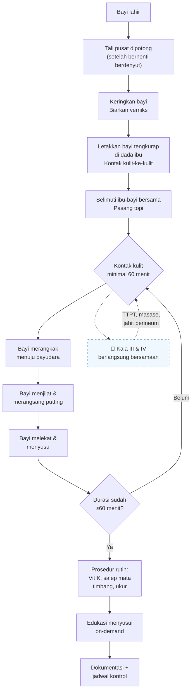

## Kenapa Keterampilan Ini Penting

**Inisiasi Menyusui Dini (IMD)** adalah proses membiarkan bayi baru lahir melakukan kontak kulit-ke-kulit dengan ibunya segera setelah lahir — tanpa intervensi — selama minimal 1 jam, sehingga bayi dapat menemukan dan menyusu pada payudara ibu secara mandiri melalui mekanisme *breast crawl* (merangkak mencari payudara).

IMD merupakan langkah pertama dari **10 Langkah Menuju Keberhasilan Menyusui** (*Ten Steps to Successful Breastfeeding*) yang direkomendasikan WHO/UNICEF dalam Inisiatif Rumah Sakit Sayang Bayi (*Baby-Friendly Hospital Initiative* — BFHI). Di Indonesia, IMD telah diwajibkan dalam Standar Pelayanan Minimal Rumah Sakit dan menjadi bagian dari 58 Langkah APN versi Kemenkes RI.

> [!tip] **Pesan Kunci:** IMD bukan sekadar "meletakkan bayi di dada ibu". Ini adalah proses fisiologis aktif di mana bayi menggunakan naluri primitifnya untuk merangkak, menemukan putting, dan menyusu sendiri — tanpa bantuan — dalam satu jam pertama kehidupan. Penundaan prosedur rutin (timbang, ukur, vitamin K, salep mata) sangat penting.

**Dampak IMD terhadap Luaran Neonatal dan Ibu:**

| Parameter | Dengan IMD | Tanpa IMD | Δ |
|-----------|-----------|-----------|---|
| Keberhasilan ASI eksklusif 6 bulan | 70–80% | 30–45% | +35% |
| Durasi menyusui rata-rata | 12–24 bulan | 4–8 bulan | +8 bulan |
| Risiko perdarahan postpartum | ↓ 40% | Normal | Protektif |
| Suhu tubuh bayi (1 jam) | 36,5–37,0°C | 35,5–36,0°C | Lebih stabil |
| Kadar gula darah neonatal (2 jam) | 55–70 mg/dL | 40–50 mg/dL | Lebih baik |

---

## Vignette Klinis

> **Vignette 1 — IMD Berhasil:**
> Bayi Ny. Dewi lahir spontan pervaginam di **Puskesmas Melati**, BB 3100 g, PB 50 cm, menangis kuat, tonus baik. Segera setelah lahir, bayi dikeringkan, ditimbang, lalu diletakkan tengkurap di dada ibu. Kontak kulit-ke-kulit dilakukan selama 75 menit. Bayi terlihat merangkak perlahan ke arah payudara kanan, menjilat putting selama 15 menit, dan akhirnya melekat dengan baik pada menit ke-45. Plasenta lahir spontan sementara IMD berlangsung.

> **Vignette 2 — IMD Terkendala Nakes:**
> Bayi Ny. Rina lahir SC karena letak sungsang di **RSKH Ibu dan Anak Pertiwi**. Setelah lahir, bidan langsung membawa bayi ke meja resusitasi untuk diukur dan ditimbang, lalu memberikan vitamin K dan salep mata tanpa melakukan IMD lebih dulu. Baru 30 menit kemudian bayi diletakkan di dada ibu. Ibu mengeluh ASI tidak lancar pada hari ke-3 postpartum.

> **Vignette 3 — IMD pada Persalinan SC:**
> Ny. Sari (G1P0A0) menjalani **SC elektif** di **RSKH Sejahtera** atas indikasi CPD. Bayi lahir dengan BB 3400 g, APGAR 9/10. Tim dokter mengizinkan IMD di ruang operasi segera setelah bayi stabil — bayi diletakkan tengkurap di dada ibu dengan kontak kulit selama 60 menit, sementara operasi ditutup. Ibu melaporkan produksi ASI lebih cepat (hari ke-1 postpartum sudah keluar kolostrum).

---

## Fisiologi IMD — *Breast Crawl*

### Naluri Bayi Baru Lahir

Bayi baru lahir memiliki **9 naluri bawaan** (*innate behaviors*) yang aktif dalam 60–90 menit pertama kehidupan — disebut *neonatal transition period* atau *first hour of golden time*:

| Urutan | Naluri | Waktu (menit) | Deskripsi |
|--------|--------|--------------|-----------|
| 1 | *Birth cry* (tangis lahir) | 0–1 | Tangisan pertama → mengembangnya paru |
| 2 | *Relaxation* (relaksasi) | 1–3 | Bayi berhenti menangis, tubuh relaks, tangan terbuka |
| 3 | *Awakening* (bangun) | 3–5 | Mata terbuka, gerakan mulut dan lidah mulai |
| 4 | *Activity* (aktivitas) | 5–15 | Bayi mulai menggerakkan lengan dan kaki, merangkak |
| 5 | *Crawling* (merangkak) | 15–35 | Gerakan mendorong kaki ke perut ibu → bergerak ke payudara |
| 6 | *Resting* (istirahat) | 35–40 | Bayi berhenti sejenak di tengah perjalanan |
| 7 | *Familiarization* (pengenalan) | 40–50 | Bayi menjilat putting, merasakan bau dan rasa areola |
| 8 | *Suckling* (menyusu) | 50–60 | Bayi melekat dan mulai mengisap kolostrum |
| 9 | *Sleeping* (tidur) | 60–90 | Bayi tertidur setelah menyusu pertama |

> [!info] **Kolostrum yang diperoleh saat IMD:**
> Volume: 2–20 ml per sesi — cukup untuk lambung bayi yang hanya sebesar kelereng (5–7 ml pada hari pertama). Kolostrum mengandung imunoglobulin (IgA), laktoferin, leukosit, dan faktor pertumbuhan yang tidak tergantikan oleh susu formula.

### Peran Oksitosin

IMD memicu **refleks oksitosin** pada ibu:

```
IMD (kontak kulit) 
    → rangsang hipotalamus posterior ibu 
    → pelepasan oksitosin 
    → kontraksi uterus 
        → mempercepat kala III 
        → mengurangi perdarahan postpartum
    → ejeksi ASI (let-down reflex)
```

> [!tip] **Manfaat Oksitosin selama IMD:**
> - Kontraksi uterus membantu pelepasan plasenta (kala III) — AMTSL bekerja sinergis.
> - Risiko atonia uteri dan perdarahan postpartum turun hingga 40%.
> - Ibu merasa tenang, nyaman, dan ikatan emosional (*bonding*) terbentuk.

---

## Indikasi dan Kontraindikasi

### Indikasi

- Semua bayi lahir **spontan pervaginam** — wajib dilakukan IMD.
- Bayi lahir **SC dengan anestesi regional** (spinal/epidural) — segera setelah ibu sadar dan bayi stabil.
- Bayi lahir SC dengan **anestesi umum** — IMD oleh ayah/pendamping sebagai alternatif, atau lakukan begitu ibu sadar penuh.
- Bayi **prematur stabil** (≥34 minggu, tidak perlu resusitasi) — IMD dapat dilakukan dengan pengawasan ketat.

### Kontraindikasi

> [!warning] **Bayi TIDAK BOLEH DIPISAHKAN dari ibu tanpa alasan medis yang jelas!** Pisahkan hanya bila benar-benar diperlukan, dan kembalikan sesegera mungkin.

| Ibu | Bayi |
|-----|------|
| Ibu tidak sadar / dalam kondisi darurat | Bayi memerlukan resusitasi >1 menit |
| Ibu dengan HIV (belum terkontrol) — rujuk tatalaksana ARV | Bayi dengan depresi napas berat (APGAR <4) |
| Ibu dengan COVID-19 aktif — lakukan IMD dengan protokol (masker, cuci tangan) — bukan kontraindikasi absolut | Bayi dengan kelainan kongenital berat (bawaan jantung sianotik, omfalokel besar) |
| Ibu dengan eklampsia / kejang | Bayi prematur <32 minggu (belum stabil) |
| | Bayi IUGR berat dengan asfiksia |
| | Bayi dengan gula darah <40 mg/dL dan simtomatik |
| Ibu menolak IMD — edukasi, jangan paksa | Bayi dengan masalah napas (RR >60, grunting, retraksi) |

> [!warning] **Bayi tidak boleh dipisah dari ibu hanya karena alasan:**
> - Bayi perlu ditimbang, diukur, diberi vitamin K atau salep mata — **semua bisa ditunda hingga 1 jam**.
> - Ibu lelah — IMD justru membantu ibu rileks berkat oksitosin.
> - "Nanti ASI-nya belum keluar" — kolostrum sudah ada sejak kehamilan.
> - Ibu menjalani SC — IMD tetap bisa dilakukan di meja operasi.
> - Bayi tampak "tidak tertarik" — beri waktu, naluri akan muncul.

---

## Persiapan

### Alat dan Bahan

| Kategori | Alat | Kegunaan |
|----------|------|----------|
| **Untuk IMD** | Kain/selimut bersih dan kering (2–3 lembar) | Mengeringkan bayi, menyelimuti ibu-bayi |
| | Topi bayi (kain katun halus) | Mencegah kehilangan panas dari kepala |
| | Kain hangat untuk menutupi punggung bayi | Mempertahankan suhu selama kontak kulit |
| | Bantal atau guling kecil | Menyangga ibu agar nyaman |
| | Tali pengaman bayi (opsional) | Mencegah bayi jatuh saat ibu bergerak |
| **Monitoring** | Stetoskop neonatus | Memantau napas dan DJJ selama IMD |
| | Oksimeter (bila ada) | Saturasi oksigen bayi |
| | Termometer | Suhu aksila bayi setiap 15 menit |
| | Jam atau timer | Memastikan durasi minimal 60 menit |
| **Alat resusitasi** (siap siaga) | Meja resusitasi + lampu sorot | Darurat — bila bayi perlu dipisahkan |
| | Sungkup + O₂ | Ventilasi bila diperlukan |
| | Konektor penghisap | Membersihkan jalan napas |

### Persiapan Ibu

1. **Edukasi saat ANC** — jelaskan IMD sejak kunjungan antenatal:
   > *"Nanti setelah bayi lahir, kami akan meletakkan bayi langsung di dada ibu tanpa dipisahkan dulu. Bayi akan mencari payudara sendiri. Ini penting untuk keberhasilan ASI eksklusif."*

2. **Informed consent persalinan** — pastikan ibu dan suami menyetujui IMD (lampirkan dalam rencana persalinan).

3. **Atur posisi ibu** — setengah duduk (*semi-recumbent*) dengan sandaran yang nyaman, atau tidur miring. Pastikan ibu dapat melihat bayinya.

4. **Bersihkan payudara** — cukup dengan air bersih. **Jangan gunakan sabun/antiseptik** pada putting dan areola (menghilangkan aroma *Montgomery glands* yang memandu bayi).

5. **Lepaskan baju ibu bagian atas** — biarkan dada terbuka untuk kontak kulit langsung.

### Persiapan Ruangan

| Item | Checklist |
|------|-----------|
| Suhu ruang 26–28°C (hangat) | ☐ |
| Tidak ada angin (AC tidak langsung ke ibu-bayi) | ☐ |
| Penerangan cukup namun tidak menyilaukan | ☐ |
| Privasi terjamin (tirai/pintu tertutup) | ☐ |
| Tempat tidur ibu stabil dan nyaman | ☐ |
| Jam dinding / timer terlihat penolong | ☐ |
| Alat resusitasi neonatus siap (tidak dipakai, tapi di dekat) | ☐ |

---

## Langkah-Langkah: 10 Langkah IMD

> [!info] **Sepuluh langkah IMD berikut mengacu pada Panduan IMD Kemenkes RI dan WHO/UNICEF BFHI.** Langkah-langkah ini dilakukan segera setelah bayi lahir dan tali pusat dipotong, sebagai rangkaian dari [[27-menolong-persalinan-fisiologis-apn]].

---

### Langkah 1 — Keringkan Bayi, Jangan Bersihkan Verniks

Segera setelah tali pusat dipotong:

- Letakkan bayi di **atas kain hangat di perut ibu** (posisi masih di atas ibu).
- **Keringkan seluruh tubuh bayi** dengan kain bersih dan hangat — tepuk-tepuk lembut, jangan digosok.
- Bersihkan muka dan kepala bayi dari darah dan mekonium.
- **Biarkan verniks kaseosa tetap menempel** — lapisan lemak putih ini melindungi kulit bayi, mengandung antibodi, dan memberikan aroma yang dikenali bayi sebagai ibunya.
- **Jangan memandikan bayi** sebelum IMD selesai.

> [!tip] **Mengapa verniks dibiarkan?**
> Verniks mengandung peptida antimikroba (laktoferin, lisozim) yang melindungi bayi dari infeksi, menjaga suhu tubuh, dan membantu bayi mengenali ibunya melalui aroma khas *amniotic fluid*.

### Langkah 2 — Letakkan Bayi Tengkurap di Dada/Perut Ibu (Kontak Kulit ke Kulit)

- **Posisi bayi:** Tengkurap di dada ibu, dengan kepala sedikit miring ke satu sisi (menjaga jalan napas tetap terbuka).
- **Kontak kulit:** Pastikan tubuh bayi (dada, perut, kaki) langsung menempel ke kulit ibu — **tidak boleh ada kain atau baju di antara mereka**.
- Kaki bayi ditekuk alami (*frog position*) di atas perut ibu.
- Kepala bayi sejajar atau sedikit lebih tinggi dari payudara.
- **Pertahankan tali pusat tetap longgar** — tidak tertarik atau tertekan.

### Langkah 3 — Selimuti Ibu dan Bayi Bersama

- Tutupi tubuh bayi dengan **kain hangat kering** di atas punggungnya.
- Selimuti ibu dan bayi bersama dengan selimut besar.
- **Pasang topi di kepala bayi** — area kepala memiliki permukaan terluas dan kehilangan panas paling besar.
- Pastikan bayi tidak kedinginan:
  - Periksa suhu aksila bayi setiap 15 menit (target: 36,5–37,5°C).
  - Tanda bayi kedinginan: sianosis akral, ekstremitas dingin, bayi rewel/gelisah.
  - Tanda bayi kepanasan: kemerahan, keringat, napas cepat.

> [!warning] **Hipotermi adalah musuh terbesar IMD:**
> - Suhu ruang harus ≥26°C.
> - Jika suhu ruang <25°C, tambahkan lampu penghangat atau *radiant warmer* di dekat tanpa mengarah langsung ke kepala bayi.
> - Jangan letakkan bayi di dekat jendela/AC.
> - Periksa suhu bayi setiap 15 menit.

### Langkah 4 — Biarkan Bayi dalam Kontak Kulit Minimal 60 Menit

- **Hitung waktu sejak bayi diletakkan di dada ibu**.
- Jangan memindahkan, memisahkan, atau menginterupsi proses ini **sebelum 60 menit penuh**.
- Plasenta boleh lahir (kala III) tanpa mengganggu posisi bayi:
  - Penolong dapat melakukan TTPT dan masase fundus dari sisi tempat tidur.
  - Pastikan tali pusat cukup panjang sehingga tidak menarik saat plasenta dilahirkan.
  - Plasenta dapat ditampung di wadah di samping tempat tidur.
- Ibu dapat dibantu untuk menyusui atau diperban setelah plasenta lahir — tetap tanpa memisahkan bayi.

### Langkah 5 — Tunda Semua Prosedur Rutin Bayi Minimal 1 Jam

**Prosedur yang DITUNDA** hingga setelah IMD selesai:

| Prosedur | Waktu Normal | Ditunda Hingga | Alasan |
|----------|-------------|----------------|--------|
| Vitamin K1 1 mg IM | Segera | Setelah IMD ≥1 jam | Nyeri suntikan mengganggu konsentrasi bayi |
| Salep mata antibiotik | Segera | Setelah IMD ≥1 jam | Menghalangi kontak mata bayi-ibu |
| Penimbangan berat badan | Segera | Setelah IMD ≥1 jam | Pemisahan fisik dari ibu |
| Pengukuran panjang badan | Segera | Setelah IMD ≥1 jam | Pemisahan fisik dari ibu |
| Pengukuran lingkar kepala | Segera | Setelah IMD ≥1 jam | Pemisahan fisik dari ibu |
| Identifikasi (gelang) | Segera | Setelah IMD ≥1 jam | *Bisa dipasang sambil bayi di dada* |

**Prosedur yang BOLEH dilakukan tanpa memisahkan bayi:**

- Memberikan Vit K1 IM — boleh **sambil bayi tetap di dada ibu** (dengan izin ibu, posisi bayi diatur sedikit).
- Pasang gelang identitas di pergelangan kaki — boleh tanpa memindahkan bayi.
- Evaluasi APGAR — lakukan sambil bayi di atas ibu.
- Memeriksa tali pusat dan kelengkapan plasenta — di samping tempat tidur.

> [!warning] **Jangan memisahkan bayi hanya untuk:**
> - "Biaya administrasi" — gelang bisa dipasang di kaki dengan bayi di dada.
> - "Bayi perlu dihangatkan di inkubator" — dada ibu adalah inkubator alami terbaik.
> - "Dokter perlu melakukan VT ulang pada ibu" — bisa dilakukan dengan bayi tetap di dada.
> - "Bayi mau disunat" — ini **tidak boleh** dilakukan dalam 24 jam pertama!

### Langkah 6 — Amati dan Biarkan *Breast Crawl* Terjadi

*Breast crawl* adalah rangkaian gerakan naluriah bayi untuk mencapai putting:

**Fase-fase breast crawl (panduan observasi):**

| Fase | Waktu | Yang Diamati |
|------|-------|-------------|
| **Relaksasi** | 1–3 menit | Bayi tenang, napas teratur, tangan terbuka |
| **Bangun** | 3–8 menit | Mata terbuka, bayi mengangkat kepala sebentar |
| **Gerakan kaki** | 5–15 menit | Bayi mendorong perut ibu dengan kakinya — gerakan merangkak |
| **Rotasi** | 10–25 menit | Bayi memutar tubuh ke arah payudara |
| **Mendekati putting** | 15–35 menit | Bayi bergerak ke arah putting, menyentuh areola |
| **Istirahat** | 30–45 menit | Bayi berhenti sejenak sebelum langkah akhir — **jangan ganggu!** |
| **Menjilat & merangsang** | 40–50 menit | Bayi menjilat putting dan areola — merangsang oksitosin |
| **Melekat & menyusu** | 50–60 menit | Bayi membuka mulut lebar, melekat, dan mulai mengisap |

> [!tip] **Yang BOLEH dan TIDAK BOLEH dilakukan penolong selama breast crawl:**
> 
> | ✅ BOLEH | ❌ TIDAK BOLEH |
> |----------|---------------|
> | Mengamati dari kejauhan | Memegang kepala bayi dan mendorong ke payudara |
> | Menjaga bayi agar tidak jatuh | Membuka mulut bayi paksa ke putting |
> | Mengatur posisi ibu bila tidak nyaman | Memeras kolostrum ke mulut bayi |
> | Memeriksa suhu bayi secara berkala | Memijat dada bayi untuk "membantu" |
> | Memberi tahu ibu apa yang terjadi | Meletakkan putting langsung ke mulut bayi |
> | Mendokumentasikan waktu | Membalikkan bayi telentang |
> | Membantu ibu duduk lebih tegak | Menarik tangan bayi ke arah payudara |

**Prinsip utama: Biarkan bayi memimpin prosesnya sendiri!**

### Langkah 7 — Bantu Bayi Melekat dengan Benar (*Latch-on*)

Setelah bayi berhasil mencapai putting (biasanya menit ke-40–60), bayi akan membuka mulut lebar dan melekat. Tanda perlekatan yang benar:

**Tanda Perlekatan Baik (*Good Latch*):**

| Tanda | Deskripsi |
|-------|-----------|
| Mulut terbuka lebar | 140–160°, seperti menguap |
| Bibir bawah terlipat keluar | Seperti "bibir ikan" |
| Dagu menyentuh payudara | Hidung sedikit menjauh — bayi masih bisa bernapas |
| Areola lebih banyak terlihat di atas | Bibir atas menutup lebih sedikit areola |
| Pipi bayi bulat | Tidak cekung saat mengisap |
| Tidak ada suara "cekikikan" | Suara menelan terdengar halus |
| Ibu tidak merasa nyeri | Mungkin tidak nyaman 10–30 detik awal, lalu hilang |
| Bayi mengisap ritmis | Irama isap-istirahat-telan |

**Bantuan minimal jika bayi kesulitan:**
1. **Jika bayi sudah di areola tetapi tidak melekat:** tunggu, biarkan bayi menjilat lebih lama — stimulasi akan memicu refleks rooting.
2. **Jika bayi menjauh dari payudara:** mungkin kelelahan — istirahatkan bayi di dada, ulangi setelah 5–10 menit.
3. **Jika bayi belum mencapai putting setelah 60 menit:** bantu dengan memindahkan bayi sedikit lebih dekat (geser ke atas, bukan memegang kepala), atau teteskan sedikit kolostrum di bibir bayi.
4. **Jika ibu memiliki putting datar/inverted:** lakukan teknik Hoffman atau pompa putting sebelum IMD — tetapi tetap biarkan bayi mencoba sendiri lebih dulu.

> [!tip] **Refleks penting yang membantu bayi:**
> - **Rooting reflex:** Bayi memutar kepala ke arah rangsangan di pipi/mulut.
> - **Sucking reflex:** Bayi mengisap benda yang menyentuh langit-langit mulut.
> - **Extrusion reflex:** Bayi mendorong keluar benda asing dari mulut — protektif.
> - **Grasp reflex:** Bayi menggenggam jari yang menyentuh telapak tangannya.

### Langkah 8 — Pantau Tanda Vital Ibu dan Bayi Selama IMD

**Pemantauan Ibu:**

| Parameter | Frekuensi | Target |
|-----------|-----------|--------|
| Kontraksi uterus | Setiap 15 menit | Keras, sepusar, konsisten |
| Perdarahan vagina | Kontinu | <500 ml total (normal), warna merah segar → normal awal |
| Tanda vital | Setiap 15–30 menit | TD normal, nadi <100×/mnt |
| Nyeri | Setiap 15 menit | Skala nyeri 0–10, terutama pada jahitan perineum/SC |
| Kenyamanan | Kontinu | Ibu tenang, tidak menggigil |

**Pemantauan Bayi:**

| Parameter | Frekuensi | Target | Alarm |
|-----------|-----------|--------|-------|
| Suhu aksila | Setiap 15 menit | 36,5–37,5°C | <36,0°C atau >37,8°C |
| Warna kulit | Setiap 15 menit | Merah muda | Sianosis, pucat, ikterus |
| Napas | Setiap 15 menit | 40–60×/mnt, reguler | <30 atau >70, grunting, retraksi |
| Saturasi O₂ | Jika tersedia | ≥95% | <90% |
| Aktivitas | Kontinu | Bergerak, menangis kuat, mengisap | Letargis, hipotonus |
| Perlekatan | Observasi | Melekat dalam 60 menit | Tidak melekat dalam 90 menit |

### Langkah 9 — Dokumentasikan Proses IMD

Dokumentasi dalam rekam medis ibu dan bayi:

**Formulir Dokumentasi IMD:**

```
| Aspek                     | Catatan                          |
|---------------------------|----------------------------------|
| Tanggal dan jam lahir     | 17/07/2026, pukul 08.15 WIB     |
| Jam mulai IMD             | 08.17 WIB                        |
| Posisi bayi               | Tengkurap di dada ibu            |
| Kontak kulit              | Ya (lengkap, tanpa kain)         |
| Waktu breast crawl dimulai| 08.22 WIB (5 menit)              |
| Waktu mencapai putting    | 08.55 WIB (38 menit)             |
| Waktu perlekatan pertama  | 09.07 WIB (50 menit)             |
| Durasi total IMD          | 75 menit                         |
| Kelancaran                | Baik                             |
| Masalah/kendala           | Tidak ada                        |
| Jam IMD selesai           | 09.32 WIB                        |
| Jam prosedur rutin        | 09.35 WIB (Vit K, salep mata)    |
| Jam timbang/ukur          | 09.40 WIB                        |
| Tanda tangan penolong     | dr. Andi / Bidan Sari            |
```

> [!info] **Dokumentasi penting secara medikolegal!** Jika terjadi perdebatan tentang ASI eksklusif atau keterlambatan intervensi, catatan IMD menjadi bukti bahwa prosedur telah dilakukan sesuai standar.

### Langkah 10 — Lakukan Edukasi ke Ibu untuk Menyusui On-Demand

Setelah IMD selesai dan prosedur rutin dilakukan:

1. **Jelaskan bahwa IMD adalah awal dari perjalanan menyusui:**
   > *"Bayi ibu sudah berhasil menyusu pertama. Sekarang, setiap kali bayi menangis atau tampak lapar, langsung susui. Tidak perlu dijadwalkan."*

2. **Ajarkan tanda-tanda lapar bayi (*feeding cues*):**
   - Bayi gelisah, menggerakkan kepala ke kiri-kanan (*rooting*).
   - Bayi memasukkan tangan ke mulut.
   - Bayi menjulurkan lidah.
   - **Jangan tunggu hingga bayi menangis** — itu tanda lapar stadium akhir.

3. **Informasikan frekuensi menyusui:**
   - Hari 1–3: 8–12 kali/24 jam (setiap 2–3 jam).
   - Setiap sesi 15–45 menit per payudara.
   - Pastikan bayi mengosongkan satu payudara sebelum beralih.

4. **Ajarkan posisi menyusui yang benar:**
   - Posisi duduk tegak dengan bantal.
   - Posisi miring (*side-lying*) — terutama malam hari.
   - Posisi *football hold* — untuk ibu SC (menghindari tekanan pada luka).

5. **Berikan kontak informasi konselor laktasi** atau jadwal kontrol: 3 hari, 7 hari, 14 hari, 28 hari.

> [!warning] **Jangan biarkan ibu pulang tanpa memahami:**
> - Kapan harus kontrol: hari ke-3 (kuning?), hari ke-7 (tali pusat lepas?), hari ke-14 (kenaikan BB).
> - Tanda bahaya bayi: kuning (sklera, dada), tidak mau menyusu, demam, kejang.
> - Tanda bahaya ibu: perdarahan, demam, payudara bengkak, nyeri.
> - Nomor kontak fasilitas kesehatan terdekat.

---

## Alur Prosedur IMD



---

## Hal-Hal Khusus

### IMD pada Persalinan SC

| Langkah | SC Spinal/Epidural | SC Anestesi Umum |
|---------|-------------------|------------------|
| IMD oleh | Ibu sendiri (segera setelah sadar) | Ayah/pendamping sebagai *skin-to-skin provider* |
| Lokasi | Meja operasi (sambil luka ditutup) | Ruang pemulihan |
| Syarat | Ibu stabil, bayi stabil, suhu ruang OK | Ayah dipakaikan baju terbuka, didampingi nakes |
| Durasi | 60 menit | 60 menit — substitusi < 30 menit oleh ayah dilanjut ibu |
| Prosedur | Bayi di dada, selimut hangat, pantau | Sama, tetapi ayah tetap pakai masker dan cuci tangan |
| Pemantauan Ibu | Perdarahan, tekanan darah, mual/muntah, nyeri luka | Kesadaran, saturasi O₂, perdarahan |

### IMD pada Bayi Prematur (≥34 minggu)

- IMD tetap boleh dilakukan jika bayi stabil — napas spontan, tidak butuh O₂, suhu stabil.
- Suhu ruang naikkan ke 27–28°C.
- Pantau ketat: saturasi O₂, suhu, napas setiap 5–10 menit.
- Jika bayi menunjukkan tanda distres (apnea, bradikardia, desaturasi), segera pisahkan dan tangani — lalu kembalikan begitu stabil.
- Nilai kesiapan prematur untuk IMD: **stabil dalam 30 menit pertama**, APGAR ≥7, tidak butuh ventilasi.

### IMD pada Ibu dengan HIV

> [!info] WHO (2023): Ibu dengan HIV yang menjalani terapi ARV dan viral load *suppressed* (<1000 kopi/ml) tetap dianjurkan IMD + ASI eksklusif selama 6 bulan. Pada ibu dengan HIV tanpa ARV atau viral load tidak terkontrol — IMD tetap dilakukan dengan pengawasan ketat, dan bayi mendapat profilaksis ARV.

### IMD Gagal — Apa yang Dilakukan?

| Situasi | Tindakan |
|---------|----------|
| Bayi tidak menunjukkan *breast crawl* setelah 30 menit | Cek suhu bayi, pastikan tidak hipotermi. Ganti posisi ibu sedikit. Teteskan kolostrum di bibir bayi. Tunggu 30 menit lagi. |
| Bayi menangis terus dan tidak tenang | Periksa: lapar? dingin? kembung? lampin basah? Perbaiki faktor pemicu. Coba posisi miring. |
| Bayi mengantuk dan tidak bangun | Periksa gula darah (jika akses ada). Pastikan tidak ada asfiksia. Rangsang dengan mengusap punggung lembut. |
| Ibu minta berhenti karena nyeri | Atur posisi ibu, berikan analgetik (parasetamol/supp). Jelaskan manfaat IMD. Jika tetap memaksa, akomodasi tanpa memaksa. |
| Perdarahan postpartum aktif | Prioritaskan penanganan ibu (kompresi bimanual, oksitosin, methergin). Bayi dirawat sementara oleh bidan — IMD selesai lebih awal, dokumentasikan. |
| Vit K belum diberikan saat IMD | Berikan setelah IMD selesai — **tidak membatalkan IMD.** |

---

## Dokumentasi dan Pencatatan

### Rekam Medis Ibu

```yaml
Prosedur: Inisiasi Menyusui Dini (IMD)
Tanggal: 17/07/2026
Jam lahir: 08.15 WIB
Jam mulai IMD: 08.17 WIB
Durasi: 75 menit
Perlekatan: Ya, pada menit ke-50
Keterangan: Bayi menyusu dengan baik pada payudara kanan
Masalah: Tidak ada
Penanggung jawab: dr. Andi
```

### Rekam Medis Bayi

```yaml
Prosedur: Inisiasi Menyusui Dini (IMD)
Jam diletakkan di dada: 08.17 WIB
Breast crawl dimulai: 08.22 WIB (menit ke-5)
Putting tercapai: 08.55 WIB (menit ke-38)
Perlekatan pertama: 09.07 WIB (menit ke-50)
Durasi menyusu: 15 menit
Suhu selama IMD: 36,6–36,8°C (stabil)
Saturasi O₂: 97–99%
Prosedur ditunda: Vit K, salep mata, timbang, ukur
Prosedur dilakukan setelah IMD: Pukul 09.35 WIB
```

---

## Kompetensi dan Assessment SKDI 4A

| Kompetensi | Kriteria | Cara Uji |
|------------|----------|----------|
| **Kognitif** | Menjelaskan fisiologi *breast crawl*, manfaat IMD, kontraindikasi, dan 10 langkah IMD | MCQ / lisan / portfolio |
| **Psikomotor** | Melakukan 10 langkah IMD pada manekin atau simulasi — mulai dari mengeringkan bayi hingga edukasi ibu | OSCE / *direct observation* |
| **Afektif** | Menunjukkan sikap sabar dan tidak intervensif — membiarkan bayi memimpin proses | Observasi sikap saat simulasi |
| **Dokumentasi** | Mencatat dengan benar parameter IMD dalam rekam medis | *Chart review* |

> [!tip] **Tips Lulus Ujian IMD:**
> - Hafalkan 10 langkah secara berurutan.
> - Tekankan pada penguji: "Biarkan bayi memimpin proses sendiri (*infant-led approach*)."
> - Sebutkan bahwa verniks tidak boleh dibersihkan, semua prosedur ditunda 1 jam, dan IMD bisa dilakukan bersamaan dengan kala III.
> - Jangan lupa dokumentasi!

---

## Ringkasan untuk Praktik Klinis

**10 Pesan Cepat IMD:**

| # | Pesan |
|---|-------|
| 1 | Lakukan segera setelah bayi lahir — sebelum prosedur lain |
| 2 | Keringkan bayi — biarkan verniks menempel |
| 3 | Kontak kulit langsung — tanpa kain penghalang |
| 4 | Selimuti ibu-bayi bersama, pasang topi |
| 5 | Biarkan bayi di dada minimal 60 menit |
| 6 | Tunda timbang, ukur, Vit K, salep mata |
| 7 | Jangan memisahkan tanpa alasan medis |
| 8 | Amati breast crawl — jangan bantu berlebihan |
| 9 | Dokumentasikan semua parameter |
| 10 | Edukasi ibu menyusui on-demand |

> [!warning] **IMD adalah HAK bayi dan ibu — bukan fasilitas yang bisa dipilih-pilih.** Setiap fasilitas kesehatan yang menolong persalinan wajib menyediakan fasilitas dan tenaga yang mendukung IMD. Kegagalan melakukan IMD tanpa alasan medis yang sah dapat menjadi dasar malpraktik medis.

---

## Referensi

1. Kemenkes RI. *Asuhan Persalinan Normal (APN)*. Jakarta: Kemenkes RI, 2020.
2. WHO/UNICEF. *Baby-Friendly Hospital Initiative: Revised, Updated and Expanded for Integrated Care*. Geneva: WHO, 2018.
3. WHO. *Guideline: Protecting, Promoting and Supporting Breastfeeding in Facilities Providing Maternity and Newborn Services*. Geneva: WHO, 2017.
4. Moore ER, Anderson GC, Bergman N, Dowswell T. *Early skin-to-skin contact for mothers and their healthy newborn infants*. Cochrane Database Syst Rev, 2016.
5. Widström AM, et al. *Newborn behaviour to locate the breast when skin-to-skin: a possible method for enabling early self-regulation*. Acta Paediatrica, 2019.
6. IDAI. *Panduan Inisiasi Menyusu Dini dan ASI Eksklusif*. Jakarta: IDAI, 2019.

---

| **Keterampilan Sebelumnya** | **Keterampilan Setelahnya** |
|-----------------------------|-----------------------------|
| [[27-menolong-persalinan-fisiologis-apn]] | [[36-manajemen-laktasi]] |
