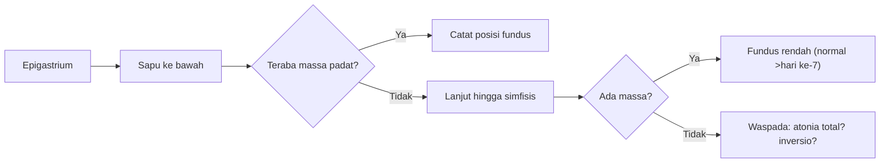
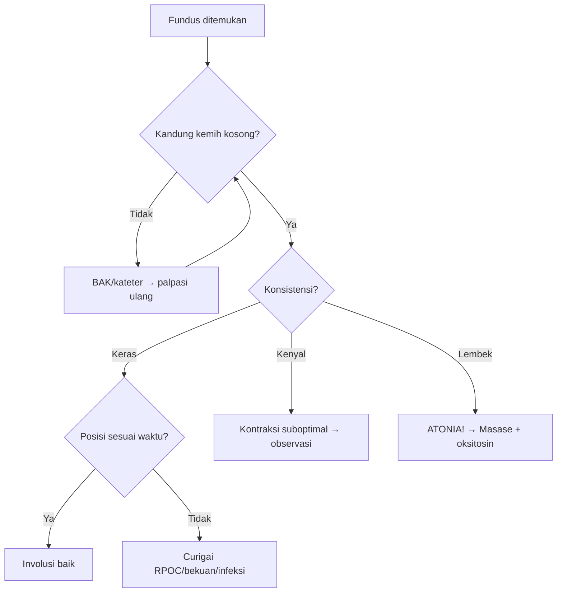

## Kenapa Keterampilan Ini Berbeda dari Skill 31

[[31-postpartum-pemeriksaan-fundus]] membahas **pengukuran TFU** — menyusuri dari simfisis ke atas dengan metline. Skill ini membahas **palpasi posisi fundus** — teknik palpasi dari epigastrium ke bawah untuk menentukan letak, bentuk, dan konsistensi fundus. Tanpa metline, tanpa tracing simfisis, dan bukan menilai deviasi lateral.

| Skill 31 — TFU | Skill 35 — Palpasi Posisi |
|---------------|---------------------------|
| Mengukur tinggi (cm/jari) | Menentukan lokasi, bentuk, konsistensi |
| Menyusuri simfisis → atas | Menyapuan dari epigastrium → bawah |
| Parameter: tinggi | Parameter: posisi, bentuk, konsistensi, kontur |
| Alat: metline | Alat: tangan (tepi ulnar + telapak) |
| Fokus: involusi, Kala IV | Fokus: atonia, subinvolusi, perdarahan tersembunyi |

> [!tip] **Inti Keterampilan:** Gunakan sensasi taktil — bukan alat ukur. Tangan Anda merasakan di mana fundus berada, bagaimana konturnya, dan seberapa keras berkontraksi.

---

## Anatomi Palpasi Fundus

### Posisi Normal Uterus Postpartum

Segera setelah plasenta lahir: fundus setinggi pusat, midline, globular (seperti bola tenis), keras, bergeser sedikit lateral. Kandung kemih penuh mendorong fundus ke atas dan lateral.

### Struktur Teraba pada Palpasi

| Struktur | Lokasi | Karakteristik Palpasi |
|----------|--------|----------------------|
| Fundus uteri | Abdomen bawah, di atas simfisis | Kubah bulat, batas tegas, keras |
| Korpus uteri | Di bawah fundus | Massa silindris, kontinu |
| Kandung kemih penuh | Anterior/superior uterus | Massa kistik, perkusi pekak, bergeser saat ditekan |
| Bekuan darah intrauterin | Dalam kavum uteri | Uterus membesar, lembek meski dimasase |
| Mioma uteri | Dinding uterus — segmental | Nodul keras, ireguler |

> [!warning] **Jangan Tertukar:** Kandung kemih kistik/fluctuant; fundus padat/keras. Kateterisasi adalah konfirmasi.

---

## Indikasi

| Indikasi | Kapan |
|----------|-------|
| Monitoring Kala IV rutin | Setiap 15' (jam I), 30' (jam II) |
| Kecurigaan atonia | Perdarahan aktif > normal, fundus lembek |
| Perdarahan tersembunyi | Syok (SI >0,9) dengan perdarahan tampak minimal |
| Kecurigaan retensio sisa plasenta | Fundus masih tinggi >2 jam postpartum |
| Kecurigaan subinvolusi | Fundus tidak turun sesuai jadwal (lihat [[31-postpartum-pemeriksaan-fundus]]) |
| Nyeri abdomen postpartum | Fundus nyeri tekan → curigai infeksi/endometritis |
| Pemeriksaan nifas sebelum pulang | Memastikan involusi sesuai hari postpartum |

---

## Persiapan

| Alat | Kegunaan |
|------|----------|
| Sarung tangan DTT/bersih | Palpasi abdomen |
| Bantal kecil | Menopang lutut agar abdomen rileks |
| Underpad/perlak | Melindungi tempat tidur |

**Tidak perlu metline.** Palpasi posisi fundus hanya menggunakan tangan.

1. **Informed consent** — "Bu, saya akan meraba perut Ibu untuk memastikan rahim di posisi yang benar."
2. **Kosongkan kandung kemih** — faktor perancu nomor satu!
3. **Posisi ibu** — *dorsal recumbent*, lutut sedikit ditekuk dengan bantal di bawah lutut.
4. **Buka area abdomen** — dari prosesus xifoideus hingga simfisis.
5. **Cuci tangan + sarung tangan.**
6. **Pemeriksa di sisi kanan pasien** — menghadap ke kepala pasien.
7. **Hangatkan tangan** — tangan dingin → pasien tegang → palpasi sulit.

---

## Langkah-Langkah

### Langkah 1 — Inspeksi

Sebelum menyentuh: kontur abdomen (benjolan di perut bawah?), simetri, kontraksi terlihat, bekas luka SC, distensi.

### Langkah 2 — Palpasi Pendahuluan (Light Palpation)

**Tujuan: menemukan fundus.**

1. Letakkan **kedua telapak tangan** di epigastrium (di atas pusat).
2. **Sapu ke arah simfisis** secara perlahan — seperti menyapu permukaan.
3. **Rasakan transisi:** area lembek (usus) → area padat (fundus).
4. Tandai batas atas fundus — garis di mana pertama kali teraba massa padat berkubah.

> [!tip] **Teknik Menyapu (Sweeping):** Gunakan **tepi ulnar** tangan dominan — paling sensitif untuk perubahan konsistensi. Bayangkan meraba puncak gunung di bawah permukaan.



### Langkah 3 — Palpasi Dalam (Deep Palpation)

#### A. Lokasi Fundus

| Cara Menilai | Normal | Abnormal |
|-------------|--------|----------|
| Bandingkan dengan pusat | Sepusar (0 jam), ↓1–2 jari (1–2 jam) | Sepusar >2 jam → retensio/atonia |
| Sumbu lurus? | Sumbu lurus | Miring → kandung kemih penuh/adhesi |

#### B. Bentuk Fundus

| Bentuk | Palpasi | Makna Klinis |
|--------|---------|--------------|
| **Globular** | Seperti bola tenis, batas tegas, cembung | Kontraksi baik — normal |
| **Discoid** | Seperti piring, lebar, datar | Kontraksi belum optimal / atonia dini |
| **Ireguler** | Permukaan tidak rata, tonjolan | Mioma uteri / bekuan darah intrauterin |
| **Elongated** | Panjang, sempit | Adhesi pasca SC / uterus bikornis |
| **Tidak teraba** | Tidak ada massa padat | Atonia total / inversio uteri / ruptur uteri |

> [!danger] **Fundus Tidak Teraba = Emergensi!** Bila 0–2 jam postpartum fundus tidak teraba, pikirkan atonia total, inversio uteri, atau ruptur uteri. Segera palpasi vaginal untuk konfirmasi inversio.

#### C. Konsistensi Fundus — Gunakan Tepi Ulnar

| Konsistensi | Sensasi | Interpretasi |
|-------------|---------|--------------|
| **Keras (firm)** | Seperti dahi — tidak mudah cekung | Kontraksi baik |
| **Kenyal (moderate)** | Seperti hidung — sedikit cekung | Kontraksi cukup — waspada |
| **Lembek (boggy)** | Seperti dagu/spons — mudah cekung | **ATONIA UTERI** — risiko PPH! |
| **Bergelombang** | Gelombang saat ditekan | Bekuan darah cair di kavum |

> [!danger] **Uterus Lembek = Atonia Uteri:** Tindakan segera → masase 5–10 putaran ringan + oksitosin 10 IU IM/IV + misoprostol 800 µg rektal jika tak membaik. Jika tetap atonia: [[42-kompresi-bimanual]] + rujuk.

#### D. Kontur dan Nyeri Tekan

| Temuan | Interpretasi |
|--------|-------------|
| Tepi tegas, terpisah dari dinding abdomen | Normal |
| Tepi tidak jelas | Edema / adhesi |
| Batas lateral melebar | Kandung kemih penuh / bekuan intrauterin |
| Nyeri tekan satu sisi | Parametritis / abses parametrial |

### Langkah 4 — Hubungan dengan Kandung Kemih

**Ini adalah langkah paling penting yang paling sering dilewati.**

1. Palpasi fundus → catat posisi.
2. Palpasi suprapubik — adakah massa kistik?
3. Perkusi suprapubik — pekak = kandung kemih penuh.
4. **Minta BAK / kateter** → **palpasi ulang** → bandingkan.

**Efek kandung kemih penuh:** Fundus terdorong ke atas (lebih tinggi), bergeser ke kanan, teraba kurang keras. Setelah dikosongkan: fundus turun 1–2 jari, kembali ke midline, lebih keras.

> [!tip] **Urutan emas:** Palpasi → BAK/kateter → **palpasi ulang** → bandingkan. Jangan simpulkan abnormal sebelum kandung kemih kosong.

### Langkah 5 — Palpasi Kontraksi

Letakkan telapak tangan di fundus dan **diamkan 30–60 detik**:

| Temuan | Makna |
|--------|-------|
| Mengeras → lembek bergantian | Kontraksi ritmik (normal Kala I–III) |
| Tetap keras terus | Normal postpartum segera |
| Tetap lembek terus | **Atonia uteri** |
| Mengeras saat ditekan, lalu lembek | Kontraksi hanya pada rangsangan → waspada atonia laten |

### Langkah 6 — Dokumentasi

Template:
```
Waktu: ____ (___ jam postpartum)
Posisi: Midline / Bergeser ke kanan / Bergeser ke kiri
Tinggi: Sepusar / ↓X / ↑X
Bentuk: Globular / Discoid / Ireguler
Konsistensi: Keras / Kenyal / Lembek
Kontur: Tegas / Tidak tegas / Melebar
Nyeri tekan: (-) / (+) _____
Kandung kemih: Kosong / Penuh
Kesan: Normal / Atonia / Subinvolusi / Curiga retensio
```

**Contoh:**
```
Waktu: 14.30 WIB (45 menit postpartum)
Posisi: Midline. Tinggi: Sepusar. Bentuk: Globular.
Konsistensi: Keras. Kontur: Tegas, simetris.
Nyeri tekan: (-). Kandung kemih: Kosong (BAK spontan).
Kesan: Normal — kontraksi baik.
```

---

## Interpretasi Klinis

### Posisi Fundus Normal Berdasarkan Waktu

| Waktu | Posisi | Bentuk | Konsistensi |
|-------|--------|--------|-------------|
| 0 jam | Sepusar | Globular | Keras |
| 1 jam | ↓1 jari | Globular | Keras |
| 2 jam | ↓1–2 jari | Globular | Keras |
| 6 jam | ↓2–3 jari | Globular–lonjong | Keras–kenyal |
| 24 jam | ↓3–4 jari | Lonjong | Kenyal |
| 3 hari | ↓5 jari | Lonjong | Kenyal |
| 5–6 hari | ↓6 jari (= simfisis) | Lonjong-panjang | Kenyal |
| 7–10 hari | Tidak teraba | — | — |

> [!info] Detail aturan "1 Jari Per Hari" ada di [[31-postpartum-pemeriksaan-fundus]].

### Temuan Abnormal

| Temuan Palpasi | Curigai | Tindakan |
|----------------|---------|----------|
| Fundus lebih tinggi + lembek | Atonia uteri | Masase + oksitosin |
| Fundus lebih tinggi + keras | Kandung kemih penuh | BAK/kateter → ulang |
| Fundus lebih tinggi + kontraksi baik + perdarahan banyak | RPOC / bekuan intrauterin | USG → evakuasi |
| Fundus tidak turun >3 hari | Subinvolusi | USG + evaluasi infeksi |
| Fundus tidak teraba + perdarahan | Atonia total / inversio uteri | Kompresi bimanual + rujuk |
| Fundus bergeser (setelah BAK) | Adhesi / massa adneksa | USG |
| Fundus nyeri tekan + hangat | Endometritis | Antibiotik + kultur |
| Fundus ireguler dengan tonjolan | Mioma uteri | USG |

### Alur Interpretasi



---

## Kesalahan yang Sering Terjadi

| Kesalahan | Dampak | Pencegahan |
|-----------|--------|------------|
| Tidak periksa kandung kemih dulu | Posisi fundus salah | Evaluasi kandung kemih dulu |
| Menyusuri dari simfisis (metode TFU) | Fokus ke tinggi, bukan posisi | Sapu dari epigastrium ke bawah |
| Hanya ujung jari, bukan tepi ulnar | Tak rasakan kontur utuh | Gunakan telapak tangan penuh |
| Menekan terlalu keras | Pasien tegang, palpasi tak akurat | Tekanan ringan-sedang, bertahap |
| Tidak dokumentasi | Tak bisa bandingkan | Catat tiap kali |
| Tak palpasi ulang setelah masase | Tak tahu efektivitas masase | Seluruh ulangi palpasi |
| Fundus tak teraba dianggap normal (hari 0–1) | Missed atonia/inversio | Raba sampai simfisis |
| Hanya fokus tinggi, abaikan bentuk+konsistensi | Informasi diagnostik hilang | Seluruh nilai ketiganya |

---

## Hubungan dengan Keterampilan Lain

| Keterampilan | Hubungan |
|-------------|----------|
| [[31-postpartum-pemeriksaan-fundus]] | **Komplementer.** Skill 35 dulu (posisi), lalu skill 31 (tinggi). |
| [[32-memperkirakan-kehilangan-darah]] | Palpasi posisi adalah langkah awal deteksi atonia → PPH. |
| [[19-palpasi-leopold]] | Leopold I (fundal grip) adalah palpasi posisi fundus antepartum. |
| [[42-kompresi-bimanual]] | Bila atonia tidak membaik setelah masase + obat. |
| [[27-menolong-persalinan-fisiologis-apn]] | Dilakukan di Kala IV sebagai bagian APN. |

---

## Uji Diri

1. Ibu postpartum 30 menit, fundus teraba lembek setinggi 2 jari di atas pusat. Interpretasi?
2. Bagaimana membedakan fundus uteri dari kandung kemih penuh?
3. Ibu postpartum hari ke-5, fundus masih 2 jari di bawah pusat. Curigai apa?
4. Mengapa palpasi posisi fundus dari epigastrium ke bawah, bukan dari simfisis ke atas?

> [!tip]- Jawaban
> **1.** Atonia uteri — lembek + lebih tinggi dari seharusnya. Tindakan: masase + oksitosin. **2.** Fundus: padat, keras. Kandung kemih: kistik, perkusi pekak, bergeser. Konfirmasi: kateterisasi. **3.** Subinvolusi — seharusnya sudah di simfisis pada hari ke-5. Curigai RPOC/endometritis. **4.** Teknik sapuan dari atas adalah yang paling sensitif merasakan transisi usus→fundus. Palpasi dari simfisis adalah metode TFU (skill 31).
