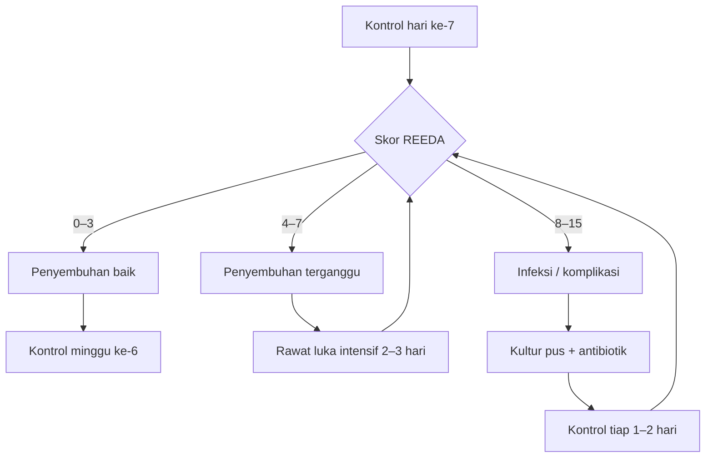

## Kenapa Keterampilan Ini Penting

**Perawatan luka episiotomi** yang baik adalah faktor penentu utama dalam kesembuhan ibu pasca persalinan. Episiotomi yang dijahit dengan sempurna sekalipun (lihat [[30-episiotomi]] dan [[33-menjahit-laserasi-12]]) dapat mengalami infeksi, dehiscence, atau penyembuhan yang buruk jika perawatan pasca tindakan tidak dilakukan dengan benar.

Setiap tahun, **10–15%** ibu postpartum dengan episiotomi mengalami infeksi luka perineum. Angka ini lebih tinggi pada:
- Kondisi higiene yang buruk
- Status gizi ibu yang kurang
- Anemia postpartum
- Persalinan dengan tindakan (vakum/forceps)
- Diabetes melitus gestasional
- Episiotomi yang luas (> 5 cm) atau perdarahan saat penjahitan

Perawatan luka episiotomi bukan sekadar "membersihkan luka" — ini mencakup:

1. **Edukasi kebersihan perineum** (*perineal hygiene*) — prinsip bersih, kering, dan steril
2. **Penilaian penyembuhan luka** — menggunakan skor REEDA (Redness, Edema, Ecchymosis, Discharge, Approximation)
3. **Deteksi dini tanda infeksi** — agar komplikasi berat dapat dicegah
4. **Manajemen nyeri** — kenyamanan ibu selama masa nifas
5. **Tatalaksana komplikasi** — infeksi ringan, dehiscence parsial, hematoma
6. **Edukasi kontrol** — jadwal kontrol dan kapan harus segera kembali

> [!tip] Prinsip Emas Perawatan Luka Episiotomi
> **Bersih, kering, dan steril.** Tiga kata kunci yang harus diingat ibu dan diinternalisasi oleh setiap tenaga kesehatan yang merawat ibu nifas.

---

## Vignette Klinis RSKH

> **Vignette I — Perawatan Rutin Hari Ke-2 Post Partum:**
>
> Seorang G1P0A0, 24 tahun, postpartum hari ke-2 (48 jam) setelah persalinan pervaginam dengan episiotomi mediolateral kanan di RSKH. Ibu mengeluh nyeri pada jahitan perineum, skala nyeri 4/10, terutama saat duduk dan BAK. Tidak demam. Pada inspeksi: luka episiotomi tampak lembab, sedikit eritema di tepi luka (skor REEDA: eritema 1/3, edema 0/3, ekimosis 0/3, discharge 0/3, aproksimasi 0/3 — total 1/15). Tidak ada pus, tidak ada bau. Dilakukan perawatan luka: kompres NaCl 0,9% steril, oleskan povidone iodine 10% di tepi luka, kompres kering steril, edukasi perineal hygiene. Ibu dipulangkan dengan jadwal kontrol 7 hari lagi.

> **Vignette II — Infeksi Luka Episiotomi Hari Ke-5:**
>
> Seorang G2P1A0, 30 tahun, postpartum hari ke-5, datang ke Poli Nifas RSKH dengan keluhan nyeri perineum yang bertambah hebat sejak 2 hari terakhir (skala 7/10), demam 38,5°C sejak semalam, dan keluar cairan kekuningan dari luka jahitan sejak pagi. Pada pemeriksaan: luka episiotomi tampak eritema luas, edema, terdapat discharge purulen dari celah jahitan, bau tidak sedap, dan tepi luka mulai terpisah (dehiscence parsial 1 cm). Skor REEDA 12/15. Dilakukan: kultur swab pus, insisi drainase pada area abses kecil, irigasi dengan NaCl 0,9% + povidone iodine, pemberian antibiotik sistemik (amoksisilin-klavulanat 3×625 mg + metronidazol 3×500 mg), analgesik (parasetamol 3×1 g), dan jadwal kontrol tiap 2 hari untuk rawat luka. Edukasi ketat tentang tanda bahaya. Dilakukan konsultasi ke spesialis obgyn.

> **Vignette III — Dehiscence Total Hari Ke-10:**
>
> Seorang G3P2A0, 35 tahun, postpartum hari ke-10, kontrol ke Poli Nifas RSKH. Ibu dengan riwayat anemia Hb 8,5 g/dL postpartum dan diabetes melitus gestasional. Mengaku selama di rumah jarang membersihkan luka karena takut sakit dan jarang ganti pembalut. Pada pemeriksaan: seluruh jahitan episiotomi terlepas, luka terbuka sepanjang 4 cm dengan dasar luka jaringan granulasi kemerahan disertai sedikit pus, tepi luka edema. Tidak demam. Diagnosis: dehiscence luka episiotomi total + infeksi luka ringan. Dilakukan: kultur pus, rawat luka terbuka dengan irigasi NaCl steril + povidone iodine 2×/hari, pemberian metronidazol 3×500 mg oral, koreksi anemia (Fe IV + transfusi PRC sesuai indikasi), kontrol gula darah ketat. Setelah 7 hari perawatan luka terbuka dan luka tampak bersih dengan jaringan granulasi baik, dilakukan penjahitan ulang (*secondary repair*). Ibu dipulangkan dengan kontrol lanjutan.

> [!warning] Pesan Kunci dari Vignette
> Perawatan luka episiotomi bukan hanya tanggung jawab tenaga kesehatan — **edukasi ibu adalah kunci**. Kegagalan edukasi → kegagalan perawatan → infeksi → dehiscence → perpanjangan masa rawat → peningkatan beban biaya dan psikologis.

---

## Anatomi yang Relevan untuk Perawatan Luka

### Area Perineum Pasca Episiotomi

Setelah episiotomi mediolateral, area luka meliputi:

| Zona | Struktur | Relevansi Perawatan |
|------|----------|-------------------|
| **Fourchette posterior** | Pertemuan labia mayora posterior | Titik awal sayatan; rentan terhadap tekanan saat duduk |
| **Dinding posterior vagina** (sepertiga distal) | Mukosa vagina | Potensi perdarahan tersembunyi; perlu inspeksi dengan spekulum |
| **Otot perineum** (m. bulbospongiosus, m. transversus perinei) | Lapisan otot superfisial | Apabila jahitan otot terbuka → dead space → abses |
| **Kulit perineum** (area mediolateral kanan/kiri) | Kulit + subkutis | Area yang tampak dan dirawat langsung; target utama higiene |

### Vaskularisasi Luka Perineum

Penyembuhan luka perineum sangat bergantung pada **suplai darah** yang kaya dari:
- **A. pudenda interna** (cabang a. iliaca interna) — arteri utama perineum
- **A. rektalis inferior** — menganastomosis dengan a. pudenda interna
- **Pleksus vena vagina** — drainase vena

> [!info] Implikasi Klinis
> Vaskularisasi yang baik = penyembuhan luka yang cepat pada kondisi normal. Namun pada keadaan anemia atau hipotensi postpartum, suplai oksigen ke jaringan perineum berkurang → penyembuhan lambat → risiko infeksi meningkat.

### Inervasi

- **N. pudendus** (S2–S4) — memberikan sensasi ke perineum
- Nyeri pasca episiotomi normal, tetapi harus **membaik secara progresif** setiap hari
- Nyeri yang bertambah (tidak membaik) → **red flag** → curigai infeksi/hematoma

---

## Fisiologi Penyembuhan Luka Perineum

Penyembuhan luka episiotomi mengikuti fase yang sama dengan penyembuhan luka bedah pada umumnya:

### Fase 1 — Inflamasi (Hari ke-0 sampai 3)

| Parameter | Deskripsi |
|-----------|-----------|
| **Proses** | Hemostasis (trombosit → fibrin → bekuan), vasodilatasi, migrasi neutrofil & makrofag |
| **Tampak klinis** | Eritema ringan, edema fisiologis, nyeri (skala 3–5/10) |
| **Suhu** | Lokal hangat, demam sistemik TIDAK normal |
| **Apa yang normal** | Nyeri ringan-sedang, sedikit bengkak |
| **Apa yang TIDAK normal** | Nyeri hebat, bengkak progresif, demam ≥ 38°C, discharge purulen |

### Fase 2 — Proliferasi (Hari ke-3 sampai 14)

| Parameter | Deskripsi |
|-----------|-----------|
| **Proses** | Fibroblas memproduksi kolagen, angiogenesis, kontraksi luka, epitelisasi |
| **Tampak klinis** | Eritema mulai pudar, edema berkurang, jaringan granulasi merah muda muncul |
| **Nyeri** | Berkurang signifikan (skala 0–2/10) |
| **Apa yang normal** | Luka tampak kering, tepi rapat, tidak ada discharge |
| **Gatal** | Ringan — tanda epitelisasi aktif |
| **Apa yang TIDAK normal** | Nyeri tetap atau bertambah, luka basah terus, discharge berbau |

### Fase 3 — Maturasi (Hari ke-14 sampai 6 bulan)

| Parameter | Deskripsi |
|-----------|-----------|
| **Proses** | Remodeling kolagen tipe III → I, kekuatan luka meningkat |
| **Tampak klinis** | Parut memudar, jaringan lunak, warna pink → putih |
| **Nyeri** | Minimal atau tidak ada (skala 0–1/10) |
| **Aktivitas** | Kembali normal bertahap |

### Skor REEDA — Alat Penilaian Objektif

Skor REEDA digunakan untuk menilai penyembuhan luka perineum secara **kuantitatif dan objektif** pada setiap kali kontrol.

| Parameter | 0 | 1 | 2 | 3 |
|-----------|---|---|---|---|
| **R**edness (Eritema) | Tidak ada | Ringan (< 0,5 cm dari tepi) | Sedang (0,5–1 cm) | Berat (> 1 cm atau meluas) |
| **E**dema | Tidak ada | Ringan (perineum sedikit menonjol) | Sedang (perineum menonjol jelas) | Berat (perineum sangat bengkak, mengkilat) |
| **E**cchymosis (Ekimosis) | Tidak ada | Ringan (< 0,5 cm) | Sedang (0,5–1 cm) | Berat (> 1 cm atau menyebar) |
| **D**ischarge | Tidak ada | Serosa (jernih, sedikit) | Serosanguinus (kemerahan) | Purulen (kuning/hijau, bau) |
| **A**pproximation (Aproksimasi) | Tepi rapat (0 gap) | Tepi rapat dengan gap minimal (< 2 mm) | Gap 2–5 mm | Gap > 5 mm atau dehiscence |

**Interpretasi:**
| Skor Total | Interpretasi | Tindakan |
|------------|--------------|----------|
| **0–3** | Penyembuhan baik | Edukasi rutin, kontrol 7–10 hari |
| **4–7** | Penyembuhan terganggu ringan | Tingkatkan frekuensi rawat luka, evaluasi ulang 2–3 hari |
| **8–11** | Infeksi / komplikasi sedang | Kultur, antibiotik, rawat luka intensif |
| **12–15** | Komplikasi berat | Rujuk ke spesialis obgyn |

> [!tip] Gunakan REEDA di Setiap Kontrol
> Catat skor REEDA di rekam medis setiap kali melakukan penilaian luka. Ini memberikan data **obyektif** tentang progres penyembuhan dan menjadi bukti dokumentasi medikolegal.

---

## Prinsip Steril & Aseptik dalam Perawatan Luka

### Kapan Perawatan Luka Dilakukan?

| Waktu | Frekuensi | Dilakukan Oleh |
|-------|-----------|---------------|
| **24 jam pertama post partum** | 1×/hari (atau setiap kali pembalut basah/penuh darah) | Dokter/bidan di fasilitas kesehatan |
| **Hari ke-2 sampai ke-5** | 1×/hari | Dokter/bidan di fasilitas kesehatan, atau perawat terlatih |
| **Hari ke-6 sampai kontrol (hari ke-7–10)** | Tidak perlu perawatan luka formal jika luka bersih dan kering | Ibu melakukan perineal hygiene mandiri |
| **Bila ada tanda infeksi** | 2×/hari (rawat luka basah) | Tenaga kesehatan terlatih |

### Persiapan Alat dan Bahan

| No. | Alat/Bahan | Keterangan |
|----|-----------|------------|
| 1 | Handscoen steril | 1 pasang (2 pasang bila ada infeksi) |
| 2 | Kasa steril | 5–10 lembar (ukuran 10×10 cm) |
| 3 | NaCl 0,9% steril | 100–200 mL untuk irigasi |
| 4 | Povidone iodine 10% | Larutan antiseptik (diencerkan 1:10 dengan NaCl bila untuk irigasi luka terbuka) |
| 5 | Pinset anatomis steril | Untuk memegang kasa saat membersihkan |
| 6 | Kom steril (bengkok / nierbeken) | Sebagai wadah NaCl dan kasa |
| 7 | Gunting / verband | Untuk memotong kasa/kain kassa |
| 8 | Pembalut wanita (sanitary pad) steril | Untuk menutup luka setelah perawatan |
| 9 | Sarung tangan bersih (non-steril) | Untuk perlindungan saat melepas pembalut kotor |
| 10 | Lampu sorot | Untuk penerangan adekuat |
| 11 | Spekulum steril (bila perlu) | Untuk inspeksi mukosa vagina bagian dalam |
| 12 | Kapas lidi steril (swab) | Untuk mengambil sampel kultur bila ada pus |
| 13 | Tempat sampah medis | Untuk pembuangan limbah infeksius |

### Langkah Perawatan Luka (Teknik Aseptik)

**Tahap 1 — Persiapan:**

1. **Cuci tangan** dengan sabun antiseptik (minimal 30 detik).
2. **Jelaskan prosedur** kepada ibu — minta izin, jaga privasi (tutup dengan kain/selimut).
3. **Posisikan ibu** — lithotomi (posisi seperti saat periksa dalam). Pastikan bokong di tepi tempat tidur.
4. **Pasang alas** (perlak/kain bersih) di bawah bokong ibu.
5. **Buka handscoen steril** — kenakan dengan teknik aseptik.
6. **Siapkan kom steril** — tuang NaCl 0,9% steril + povidone iodine.

**Tahap 2 — Inspeksi dan Penilaian:**

1. **Buka pembalut** dengan tangan bersih (bukan handscoen steril) — buang ke tempat sampah medis.
2. **Inspeksi awal** (tanpa menyentuh luka):
   - Warna: merah/pucat/sianosis
   - Ukuran: apakah jahitan tampak rapat atau meregang
   - Discharge: ada/tidak, warna, bau, jumlah
   - Edema: ringan/sedang/berat
   - Ekimosis: ada/tidak, luas
3. **Dokumentasi skor REEDA** di rekam medis.

**Tahap 3 — Pembersihan:**

1. **Bersihkan area sekitar luka** — arah dari **depan ke belakang** (dari vulva ke arah anus), bukan sebaliknya:
   - Gunakan kasa steril basah NaCl → usap satu kali per kasa, buang
   - Ulangi hingga bersih dari darah kering dan debris
2. **Irigasi luka** dengan NaCl 0,9% steril — semprot perlahan dari arah atas (vulva) ke bawah (anus).
3. **Keringkan** dengan kasa steril — tepuk lembut (jangan digosok!). Arah dari depan ke belakang.
4. **Oleskan povidone iodine 10%** pada **tepi luka dan sekitarnya** (bukan langsung ke dalam luka terbuka!) — gunakan kasa steril atau kapas lidi steril.
5. **Untuk luka yang bersih dan rapat** — cukup oles tipis di tepi luka.
6. **Untuk luka dengan dehiscence/infeksi** — lakukan irigasi dengan NaCl + povidone iodine (encer 1:10), biarkan luka terbuka (tidak ditutup rapat).

> [!warning] Kontraindikasi Penggunaan Povidone Iodine
> - Jangan oleskan povidone iodine **langsung ke dalam luka terbuka** dalam konsentrasi penuh (10%) — dapat merusak jaringan granulasi.
> - Encerkan 1:10 dengan NaCl 0,9% untuk irigasi luka terbuka.
> - Hati-hati pada ibu dengan **alergi iodine** — gunakan klorheksidin 0,05% sebagai alternatif.
> - Jangan gunakan alkohol pada luka perineum — nyeri hebat dan merusak jaringan.

**Tahap 4 — Penutupan:**

1. **Pasang pembalut steril** (sanitary pad) — jangan terlalu ketat.
2. **Rapikan ibu** — bersihkan sisa cairan, lepaskan alas.
3. **Buang handscoen** ke tempat sampah medis.
4. **Cuci tangan** kembali.

**Tahap 5 — Dokumentasi:**

Catat dalam rekam medis:
```
Tanggal perawatan: _________________
Jam: _________________
Skor REEDA:
  Redness: ___ /3
  Edema: ___ /3
  Ecchymosis: ___ /3
  Discharge: ___ /3
  Approximation: ___ /3
  Total: ___ /15
Tindakan: ☐ Irigasi NaCl ☐ Povidone iodine ☐ Kompres kasa steril ☐ Kultur swab
Obat topikal: _________________________________
Pembalut: ☐ Dipasang baru ☐ Luka dibiarkan terbuka
Rencana kontrol: _________________
Tanda tangan: _________________
```

---

## Prinsip Jahitan Kering

Salah satu prinsip paling penting dalam perawatan luka episiotomi adalah **menjaga jahitan tetap kering**:

### Mengapa Jahitan Harus Kering?

| Kondisi | Akibat |
|---------|--------|
| **Luka lembab terus-menerus** | Medium ideal untuk pertumbuhan bakteri (terutama *E. coli*, *Bacteroides fragilis*, *Staph. aureus*) |
| **Pembalut jarang diganti** | Luka terendam darah/lokia → maserasi → infeksi |
| **Tidak dikeringkan setelah BAK/BAB** | Urin/feses mengiritasi luka → dermatitis → infeksi sekunder |
| **Duduk terlalu lama tanpa alas** | Tekanan + kelembaban → iskemia tepi luka → nekrosis → dehiscence |
| **Menggunakan sabun wangi/antiseptik keras** | Iritasi kimia → alergi → dermatitis → memperlambat epitelisasi |

### Cara Menjaga Jahitan Tetap Kering

1. **Ganti pembalut setiap 4–6 jam** — atau lebih sering jika pembalut sudah basah/penuh.
2. **Setelah BAK** — siram perineum dengan air bersih mengalir (dari depan ke belakang), keringkan dengan tisu lembut atau kasa dengan cara **tepel-tepel** (jangan digosok!).
3. **Setelah BAB** — bersihkan dari depan ke belakang, basuh dengan air mengalir, keringkan.
4. **Gunakan celana dalam katun** — lebih menyerap keringat, sirkulasi udara lebih baik.
5. **Hindari celana dalam ketat / bahan sintetis** — meningkatkan kelembaban dan gesekan.
6. **Uddara luka** — anjurkan ibu untuk tidur tanpa celana dalam selama 15–20 menit, 2–3×/hari, di atas alas bersih (alas kain atau perlak).

> [!tip] Teknik "Air-drying"
> Setelah perawatan luka atau setelah mandi, biarkan area perineum **terkena udara** selama 10–15 menit sebelum memakai pembalut baru. Ini secara signifikan menurunkan risiko infeksi jamur dan bakteri.

---

## Tanda Infeksi Luka Episiotomi

### Tanda Dini (Kuning — Waspada)

| Tanda | Deskripsi | Tindakan |
|-------|-----------|----------|
| **Nyeri tidak membaik** setelah hari ke-3 | Nyeri tetap skala 4–6/10 atau bertambah | Evaluasi luka, skor REEDA |
| **Eritema** ringan di sekitar jahitan (< 1 cm) | Kemerahan yang meluas dari tepi luka | Tingkatkan frekuensi rawat luka |
| **Edema** yang tidak berkurang setelah hari ke-3 | Bengkak pada perineum | Kompres dingin, evaluasi tiap 24 jam |
| **Discharge serosa** berlebihan | Cairan jernih kekuningan dalam jumlah banyak | Irigasi lebih sering, kultur jika menetap |
| **Subfebril** (37,5–38°C) | Demam ringan tanpa tanda toksik | Observasi, periksa tanda infeksi lain |

### Tanda Infeksi Lanjut (Merah — Bahaya)

| Tanda | Deskripsi | Tindakan |
|-------|-----------|----------|
| **Nyeri bertambah hebat** (skala 7–10/10) | Tidak membaik dengan analgesik biasa | Segera evaluasi, curigai abses |
| **Demam > 38°C** | Demam sistemik — bakteri sudah masuk sirkulasi | Kultur darah + urin, antibiotik IV |
| **Discharge purulen** | Cairan kuning/hijau, kental, berbau | Kultur pus, antibiotik |
| **Eritema meluas** > 2 cm dari tepi luka | Selulitis perineum | Rawat inap, antibiotik IV, konsul spesialis |
| **Dehiscence** (jahitan mulai lepas) | Tepi luka terbuka sebagian/seluruhnya | Rawat luka terbuka, kultur, antibiotik |
| **Bau busuk** dari luka | Infeksi bakteri anaerob | Metronidazol tambahan, debridemen |
| **Nekrosis jaringan** | Jaringan hitam/keabu-abuan di tepi luka | Debridemen, konsul spesialis |
| **Fasciitis necrotizans** | Nyeri di luar proporsi, krepitasi, toksik sistemik | **KEGAWATDARURATAN** — rujuk segera! |

### Kapan ke IGD?

> [!danger] Segera ke IGD jika:
> - Demam ≥ 39°C dengan menggigil
> - Nyeri perineum yang **tidak tertahankan** (skala 8–10/10)
> - Luka terbuka total (seluruh jahitan lepas)
> - Keluar darah segar dalam jumlah banyak dari luka
> - Bengkak perineum yang cepat membesar (curigai hematoma)
> - Tanda sistemik: sesak, pucat, tekanan darah rendah, kebingungan
> - Krepitasi pada perineum (udara dalam jaringan → curigai infeksi gas)
> - Tidak bisa BAK (retensi urin akibat nyeri/edema perineum berat)

### Infeksi yang Sering Terjadi

| Patogen | Karakteristik | Antibiotik Pilihan |
|---------|--------------|-------------------|
| **Escherichia coli** | Paling sering (berasal dari rektum), discharge kehijauan, bau khas | Sefalosporin generasi 2–3 |
| **Bacteroides fragilis** | Anaerob, bau busuk, jaringan nekrosis | Metronidazol |
| **Staphylococcus aureus** | Pus kuning kental, abses terlokalisir | Kloksasilin / sefalosporin |
| **Streptococcus agalactiae** (GBS) | Eritema meluas cepat, demam tinggi | Penicillin G / ampisilin |
| **Mixed aerob-anaerob** | Paling sering pada infeksi lanjut | Amoksisilin-klavulanat atau sefalosporin + metronidazol |

---

## Edukasi Ibu (Perineal Hygiene)

Edukasi adalah pilar utama perawatan luka episiotomi. Ibu harus mampu merawat lukanya sendiri di rumah.

> [!tip] Komunikasi Efektif dengan Ibu
> Gunakan bahasa sederhana, demonstrasi langsung jika perlu, dan berikan **lembar balik / leaflet** yang bisa dibawa pulang. Minta ibu untuk **mengulangi kembali** (*teach-back*) apa yang harus dilakukan.

### 1. Kebersihan Perineum (*Perineal Hygiene*)

**Yang harus dilakukan:**

| Langkah | Cara |
|---------|------|
| **Setelah BAK** | Siram perineum dengan air bersih mengalir (dari depan ke belakang). Keringkan dengan tisu/kasa lembut — tepuk, jangan gosok. |
| **Setelah BAB** | Bersihkan dari depan ke belakang. Basuh dengan air mengalir dan sabun ringan (tanpa pewangi). Keringkan. |
| **Ganti pembalut** | Setiap 4–6 jam atau segera setelah basah. Cuci tangan sebelum dan sesudah. |
| **Mandi** | Boleh mandi 1×/hari — siram air dari depan ke belakang. **Jangan berendam** di bathtub/bak mandi. |
| **Handuk** | Gunakan handuk khusus untuk area perineum (terpisah dari handuk badan). Ganti setiap 2 hari. |

**Yang TIDAK boleh dilakukan:**

| Larangan | Alasan |
|----------|--------|
| Menggosok area jahitan | Menyebabkan iritasi, perdarahan, dan robeknya jahitan |
| Menggunakan sabun wangi/antiseptik keras | Iritasi kimia, alergi, mengganggu flora normal |
| Membersihkan dari belakang ke depan | Membawa bakteri dari anus ke luka |
| Berendam / duduk di bak mandi | Meningkatkan risiko infeksi ascending |
| Menggunakan bedak / talek di area jahitan | Menyumbat pori, meningkatkan iritasi |
| Menyemprot parfum atau deodoran vagina | Memicu iritasi dan alergi |
| Menahan BAK karena takut sakit | Retensi urin → infeksi saluran kemih |
| Menggunakan pembalut lebih dari 6 jam | Medium pertumbuhan bakteri |

### 2. Manajemen Nyeri

| Metode | Cara | Frekuensi |
|--------|------|-----------|
| **Kompres dingin** | Cold pack dibungkus kain, tempelkan 15–20 menit | Setiap 4 jam (24–48 jam pertama) |
| **Duduk di permukaan keras** | Kursi kayu lebih baik dari sofa empuk | Setiap kali duduk |
| **Bantal donat (*doughnut pillow*)** | Mengurangi tekanan langsung pada perineum | Saat duduk lama |
| **Parasetamol** | 500 mg–1 g per oral | Setiap 6 jam (maks 4 g/hari) |
| **Ibuprofen** | 400 mg per oral | Setiap 8 jam (bila perlu, setelah makan) |
| **Posisi miring** | Tidur miring (bukan telentang) — kurangi tekanan perineum | Saat tidur/istirahat |
| **Teknik relaksasi** | Napas dalam saat nyeri hebat | Setiap kali nyeri |

> [!info] Bolehkan Menggunakan Salep atau Krim?
> - Hindari salep/krim topikal tanpa resep dokter pada luka jahitan.
> - Salep antibiotik topikal (misal: gentamisin krim, fusidic acid) hanya diberikan bila ada tanda infeksi dan atas indikasi dokter.
> - Krim anestesi lokal (lidokain) dapat digunakan pada kasus nyeri hebat — konsultasi dulu dengan dokter.

### 3. Pola Buang Air

**BAK (Miksi):**

| Masalah | Solusi |
|---------|--------|
| **Nyeri saat BAK** | Siram perineum dengan air hangat saat BAK. Duduk dengan posisi agak condong ke depan. |
| **Tidak bisa BAK** | Kompres hangat di perut bawah. Dengarkan suara air mengalir. Jika 6 jam tidak BAK → ke fasilitas kesehatan. |
| **Anyang-anyangan** | Minum banyak air. Jika disertai demam → curigai ISK → ke dokter. |

**BAB (Defekasi):**

| Masalah | Solusi |
|---------|--------|
| **Sembelit pasca persalinan** | Makan tinggi serat (sayur, buah), minum ≥ 2 L/hari. Laksatif ringan (laktulosa 15–30 mL malam hari) bila perlu. |
| **Nyeri saat BAB** | Pegang perineum dengan kasa bersih saat mengejan — ini memberi counter-pressure dan mengurangi rasa tertarik pada jahitan. |
| **Mengejan** | Hindari mengejan berlebihan. Jika BAB keras → gunakan supositoria gliserol atau bisakodil. |

### 4. Tanda Bahaya yang Harus Dipahami Ibu

Buat ibu menghafal **5 TANDA BAHAYA** berikut:

| No. | Tanda | Artinya |
|-----|-------|---------|
| 1 | **Demam** ≥ 38°C | Infeksi sistemik — segera ke dokter |
| 2 | **Nyeri yang bertambah** (tidak mereda) | Curigai infeksi/abses/hematoma |
| 3 | **Keluar cairan berbau busuk** | Infeksi bakteri |
| 4 | **Perdarahan segar dari luka** | Perdarahan aktif atau jahitan lepas |
| 5 | **Bengkak membesar / kulit kebiruan** | Hematoma perineum |

> [!warning] Pesan Kuat ke Ibu
> "Jika demam, jika nyeri bertambah, jika keluar cairan kuning atau berbau dari jahitan, atau jika jahitan terlepas — **JANGAN TUNGGU** sampai jadwal kontrol. Segera datang ke fasilitas kesehatan terdekat."

### 5. Aktivitas dan Istirahat

| Aktivitas | Kapan Boleh | Catatan |
|-----------|-------------|---------|
| **Jalan di dalam rumah** | Segera — hari ke-1 postpartum | Jalan pelan, jangan terlalu lama |
| **Naik turun tangga** | Setelah hari ke-3 | Pegang rambatan, pelan |
| **Duduk lama** > 30 menit | Mulai hari ke-5 | Gunakan bantal donat |
| **Menyetir mobil** | 2 minggu | Duduk di kursi keras, pasang sabuk pengaman di bawah perut |
| **Angkat beban** > 5 kg | 4–6 minggu | Beban berlebih → tekanan intraabdomen → tarikan jahitan |
| **Olahraga berat** | 6 minggu | Konsultasi dulu dengan dokter |
| **Hubungan seksual** | 4–6 minggu (setelah luka sembuh total) | Mulai perlahan, gunakan pelumas berbasis air |
| **Kembali kerja** | 4–6 minggu (tergantung jenis pekerjaan) | Jika pekerjaan duduk → bantal donat |
| **Bersepeda** | 6–8 minggu | Tekanan langsung pada perineum |

### 6. Nutrisi untuk Penyembuhan Luka

| Zat Gizi | Sumber | Manfaat |
|----------|--------|---------|
| **Protein** | Telur, ikan, daging, tahu, tempe, kacang-kacangan | Bahan dasar sintesis kolagen dan jaringan baru |
| **Vitamin C** | Jeruk, jambu biji, tomat, brokoli, pepaya | Kofaktor sintesis kolagen, antioksidan, meningkatkan imunitas |
| **Vitamin A** | Wortel, bayam, ubi, hati ayam | Epitelisasi, diferensiasi sel |
| **Zinc (seng)** | Daging merah, kerang, kacang almond, biji labu | Proliferasi sel, sintesis protein, imunitas |
| **Zat besi** | Daging merah, bayam, kacang hijau, hati | Mencegah anemia → oksigenasi jaringan optimal |
| **Cairan** | Air putih ≥ 2 L/hari | Menjaga kelembaban jaringan, mencegah sembelit |

---

## Jadwal Kontrol

### Kontrol Rutin

| Waktu Kontrol | Tujuan | Tindakan |
|---------------|--------|----------|
| **Hari ke-7 sampai 10 postpartum** | Evaluasi penyembuhan luka | Skor REEDA, lepas jahitan (jika benang non-absorbable — jarang dipakai), edukasi |
| **Minggu ke-4 sampai 6** | Evaluasi hasil akhir penyembuhan | Inspeksi parut, tanda infeksi lambat, penilaian nyeri, dispareunia |
| **Minggu ke-6** | Kunjungan nifas lengkap | Periksa involusi uterus, lokia, payudara, kontrasepsi, episiotomi |

### Kontrol Khusus (Bila Ada Masalah)

| Kondisi | Jadwal Kontrol | Tindakan Khusus |
|---------|----------------|-----------------|
| **Skor REEDA 4–7** | Kontrol tiap 2–3 hari | Rawat luka, evaluasi REEDA setiap kali |
| **Infeksi ringan-sedang** | Kontrol tiap 1–2 hari | Kultur + antibiotik, rawat luka basah |
| **Dehiscence parsial** | Kontrol tiap 2 hari | Rawat luka terbuka, rencanakan jahit ulang setelah jaringan granulasi baik (5–7 hari) |
| **Dehiscence total** | Rawat inap | Jahit ulang sekunder, rawat luka tiap hari |
| **Hematoma perineum** | Rawat inap | Evakuasi bila > 5 cm, observasi ketat |

### Alur Keputusan Kontrol



Catatan: Diagram di atas adalah ilustrasi alur keputusan. Dalam praktik klinis, gunakan penilaian klinis komprehensif.

---

## Komplikasi dan Tatalaksana

### 1. Hematoma Perineum

| Item | Detail |
|------|--------|
| **Waktu muncul** | < 24 jam postpartum (paling sering < 2 jam) |
| **Gejala** | Nyeri perineum hebat dan progresif, bengkak, kulit kebiruan/keunguan, syok (pucat, hipotensi) tanpa perdarahan eksternal yang sebanding |
| **Diagnosis** | Klinis + pemeriksaan fisik. Ultrasound (bila tersedia) untuk konfirmasi ukuran. |
| **Penanganan** | |
| — < 5 cm | Observasi, kompres dingin, analgesik. Umumnya absorbsi spontan dalam 7–14 hari. |
| — ≥ 5 cm atau ekspansif | Evakuasi (insisi, keluarkan bekuan, ligasi pembuluh aktif), jahit ulang. Rujuk ke spesialis obgyn. |
| **Pencegahan** | Hemostasis yang baik saat menjahit (tutup dead space), identifikasi perdarahan aktif sebelum menutup lapisan kulit. |

### 2. Infeksi Luka (Selulitis / Abses)

| Item | Detail |
|------|--------|
| **Waktu muncul** | 48 jam – 7 hari postpartum |
| **Gejala** | Nyeri bertambah (tidak sesuai fase penyembuhan), eritema meluas, edema, discharge purulen, demam ≥ 38°C |
| **Penanganan** | |
| — Ringan (REEDA 4–7) | Rawat luka 2×/hari, antibiotik oral (amoksisilin-klavulanat 3×625 mg), analgesik |
| — Sedang (REEDA 8–11, abses terlokalisir) | Kultur pus, insisi drainase, irigasi NaCl + povidone iodine, antibiotik oral/IV, rawat luka 2×/hari |
| — Berat (REEDA 12–15, selulitis luas) | Rawat inap, antibiotik IV (sefotaksim 3×1 g + metronidazol 3×500 mg), konsul spesialis obgyn |
| **Antibiotik empiris** | Amoksisilin-klavulanat 3×625 mg oral (ringan-sedang) atau sefalosporin generasi 3 IV + metronidazol (berat) |
| **Durasi antibiotik** | Minimal 7 hari atau sampai 48 jam setelah demam turun dan tanda infeksi membaik |
| **Kegagalan terapi** | Jika 48–72 jam tidak membaik → evaluasi ulang, ganti antibiotik berdasarkan hasil kultur, konsul spesialis |

### 3. Dehiscence Luka

| Item | Detail |
|------|--------|
| **Waktu muncul** | 3–10 hari postpartum |
| **Penyebab** | Infeksi, hematoma, jahitan terlalu kencang/terlalu longgar, trauma, anemia, DM, malnutrisi |
| **Klasifikasi** | |
| — Dehiscence parsial | Sebagian jahitan lepas (< 50% panjang luka) |
| — Dehiscence total | Seluruh jahitan lepas (luka terbuka penuh) |
| **Penanganan (secara umum)** | |
| 1. **Rawat luka terbuka** — irigasi NaCl + povidone iodine (encer) 2×/hari, tutup dengan kasa steril kering |
| 2. **Kultur pus** — cari patogen penyebab |
| 3. **Antibiotik sistemik** — bila ada tanda infeksi |
| 4. **Koreksi faktor predisposisi** — anemia, DM, gizi buruk |
| 5. **Tunggu jaringan granulasi baik** — biasanya 5–7 hari |
| 6. **Jahit ulang sekunder (*secondary repair*)** — setelah luka bersih dan jaringan granulasi terbentuk baik |
| **Kapan jahit ulang** | Luka sudah bersih (tidak ada pus), jaringan granulasi kemerahan, tidak ada edema, tidak demam. Biasanya 5–10 hari sejak dehiscence. |
| **Teknik jahit ulang** | Sama seperti penjahitan primer (lihat [[33-menjahit-laserasi-12]]), dengan eksisi tepi luka (freshening edges) jika perlu. |

### 4. Nyeri Berkelanjutan

| Item | Detail |
|------|--------|
| **Definisi** | Nyeri perineum yang menetap > 2 minggu postpartum |
| **Penyebab** | Jahitan terlalu kencang, jaringan parut hipertrofik, neuroma, infeksi subklinis, *pelvic floor tension myalgia* |
| **Tatalaksana** | |
| — Fisioterapi dasar panggul | Relaksasi otot, biofeedback |
| — Massage perineum | Perlahan, mulai minggu ke-4, gunakan pelumas |
| — Analgesik | Parasetamol / NSAID sesuai kebutuhan |
| — Rujuk | Jika nyeri menetap > 6 minggu → konsul spesialis obgyn atau fisioterapi dasar panggul |

### 5. Jaringan Parut Hipertrofik / Keloid

| Item | Detail |
|------|--------|
| **Waktu muncul** | 4–12 minggu postpartum |
| **Gejala** | Parut menonjol, keras, gatal, nyeri tekan, dapat menyebabkan dispareunia |
| **Faktor risiko** | Riwayat keloid, infeksi luka, jahitan terlalu kencang, iritasi kronis |
| **Tatalaksana** | |
| — Silicone gel / sheet | Dimulai setelah luka benar-benar kering (biasanya minggu ke-4) |
| — Massage parut | 5–10 menit, 2×/hari |
| — Injeksi steroid intralesi | Bila hipertrofik berat → rujuk ke spesialis |
| — Eksisi parut + jahitan ulang | Pada kasus keloid berat |
| **Rujukan** | Ke spesialis obgyn / bedah plastik bila parut mengganggu fungsi |

---

## Dokumentasi

Setiap kali melakukan perawatan atau evaluasi luka episiotomi, dokumentasikan secara lengkap:

### Format Dokumentasi Rawat Luka

```markdown
**Catatan Perawatan Luka Perineum**

Tanggal: _______________  Jam: _______________
Nama ibu: _______________  Umur: _____ th  Paritas: P___

Riwayat:
  - Persalinan: spontan / vakum / forceps / SC   Tgl: _______________
  - Episiotomi: ya (mediolateral/mediana) / laserasi derajat ___
  - Penjahitan: tgl _______________  Pelaksana: _______________
  - Antibiotik: ya (_______________) / tidak
  - Komorbid: DM / anemia / hipertensi / lainnya _______________

Keluhan ibu: _______________________________________________

Pemeriksaan Fisik:
  Suhu: _____°C  TD: _____/_____ mmHg  N: _____×/mnt

Status Lokalis Perineum:
  Inspeksi:  ☐ Luka tertutup rapat  ☐ Luka terbuka (___ cm)
             ☐ Eritema (___ cm dari tepi)  ☐ Edema
             ☐ Discharge: ☐ Tidak ada  ☐ Serosa  ☐ Purulen  ☐ Berbau
             ☐ Ekimosis  ☐ Nekrosis  ☐ Jaringan granulasi
  Palpasi:   ☐ Nyeri tekan  ☐ Fluktuasi (curigai abses)
             ☐ Krepitasi  ☐ Hangat lokal

Skor REEDA:
  R ___/3 + E ___/3 + E ___/3 + D ___/3 + A ___/3 = ___/15

Tindakan:
  ☐ Irigasi NaCl 0,9%
  ☐ Povidone iodine 10% (encer 1:10)
  ☐ Kompres kasa steril kering
  ☐ Kultur swab pus
  ☐ Insisi drainase abses
  ☐ Debridemen jaringan nekrotik
  ☐ Pembalut baru
  ☐ Luka dibiarkan terbuka
  ☐ Antibiotik: ___________________
  ☐ Analgesik: ___________________

Rencana:
  ☐ Kontrol ulang tgl: _______________
  ☐ Edukasi ulang perineal hygiene
  ☐ Rujuk ke spesialis obgyn

Dokter/Bidan: ___________________  Paraf: ___________
```

---

## Poin Penting untuk Dihafalkan

1. **Prinsip emas**: Bersih, kering, steril — tiga kata kunci perawatan luka episiotomi.
2. **Skor REEDA** — alat penilaian obyektif untuk penyembuhan luka perineum. Gunakan di setiap kontrol.
3. **Edukasi ibu adalah kunci** — ibu harus tahu cara membersihkan, kapan ganti pembalut, dan tanda bahaya.
4. **Membersihkan dari depan ke belakang** — jangan pernah dari belakang ke depan (bawa bakteri anus ke luka).
5. **Jahitan harus kering** — ganti pembalut 4–6 jam, keringkan setelah BAK/BAB, hindari kelembaban.
6. **Nyeri harus membaik** setiap hari. Nyeri bertambah = RED FLAG = curigai infeksi atau hematoma.
7. **Demam postpartum** — jangan anggap remeh. Selalu evaluasi luka episiotomi sebagai sumber infeksi.
8. **Povidone iodine** — oleskan di tepi luka (bukan di dalam luka terbuka). Encerkan 1:10 untuk irigasi luka terbuka.
9. **Dehiscence** — rawat luka terbuka, kultur, antibiotik, koreksi faktor risiko, jahit ulang setelah jaringan granulasi baik.
10. **Kontrol wajib** — hari ke-7 sampai 10 postpartum untuk evaluasi luka, minggu ke-6 untuk kunjungan nifas lengkap.
11. **Integrasi klinis** — keterampilan ini adalah kelanjutan dari [[30-episiotomi]] dan [[33-menjahit-laserasi-12]], dan membutuhkan [[37-mengajarkan-hygiene]] untuk edukasi ibu yang efektif.

---

## Alur Pikir Klinis (Clinical Reasoning)

```
Ibu postpartum dengan luka episiotomi
                    ↓
       Evaluasi: Skor REEDA + suhu + keluhan
                    ↓
       ┌────────────┼────────────┐
       ↓            ↓            ↓
   REEDA 0–3    REEDA 4–7    REEDA 8–15
   Baik         Terganggu    Infeksi
       ↓            ↓            ↓
   Edukasi +   Rawat luka   Kultur + AB
   kontrol     ↑ frekuensi  Rawat luka
   7–10 hari    kontrol      intensif
                 2–3 hari    Kontrol
                             1–2 hari
```

---

## Referensi

1. Kemenkes RI. *Asuhan Persalinan Normal (APN)*. Jakarta: Kementerian Kesehatan RI; 2020.
2. WHO. *WHO Recommendations on Postnatal Care of the Mother and Newborn*. Geneva: World Health Organization; 2013.
3. NICE. *Postnatal Care*. NICE Guideline [NG194]. London: National Institute for Health and Care Excellence; 2021.
4. RCOG. *Management of Third- and Fourth-Degree Perineal Tears*. Green-top Guideline No. 29. London: Royal College of Obstetricians and Gynaecologists; 2015 (reviewed 2019).
5. ACOG. *Prevention and Management of Obstetric Lacerations at Vaginal Delivery*. Practice Bulletin No. 198. Obstet Gynecol. 2018;132(3):e87–e102.
6. POGI. *Pedoman Pelayanan Antenatal, Intranatal, dan Postnatal*. Jakarta: Perkumpulan Obstetri dan Ginekologi Indonesia; 2021.
7. Cunningham FG, Leveno KJ, Bloom SL, et al. *Williams Obstetrics*. 26th ed. McGraw-Hill Education; 2022.
8. Bick D, et al. *Perineal Care and Repair*. In: Mayes' Midwifery. 16th ed. Elsevier; 2022.
9. Kindig M, et al. *Perineal Repair: A Guide for Clinicians*. Obstet Gynecol Clin North Am. 2021;48(3):457–472.
10. Albers LL, et al. *Perineal Care after Spontaneous Vaginal Birth*. Cochrane Database Syst Rev. 2020;(12):CD004230.
11. East CE, et al. *Local Heat and Cold Application for Perineal Pain Relief after Vaginal Birth*. Cochrane Database Syst Rev. 2019;(6):CD013394.
12. Shekhar S, et al. *REEDA Score as a Tool for Assessing Perineal Wound Healing: A Validation Study*. J Obstet Gynaecol India. 2022;72(3):225–231.

---

> [!info] Catatan Revisi
> - Modul ke-39 — Buku Saku Obgyn: Keterampilan Persalinan
> - Level kompetensi SKDI: 4A (mahir mandiri)
> - Fokus pada: perawatan luka episiotomi komprehensif — dari prinsip steril, deteksi dini infeksi, tatalaksana komplikasi, hingga edukasi dan jadwal kontrol
> - Terintegrasi dengan [[30-episiotomi]], [[33-menjahit-laserasi-12]], dan [[37-mengajarkan-hygiene]]
> - Skor REEDA sebagai alat penilaian obyektif utama
> - Disusun berdasarkan WHO, NICE, RCOG, ACOG, POGI
> - Revisi terakhir: Juli 2026
